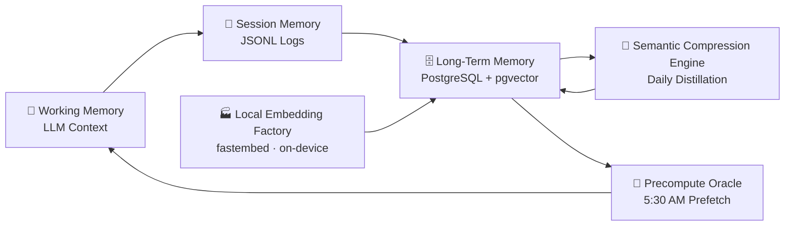
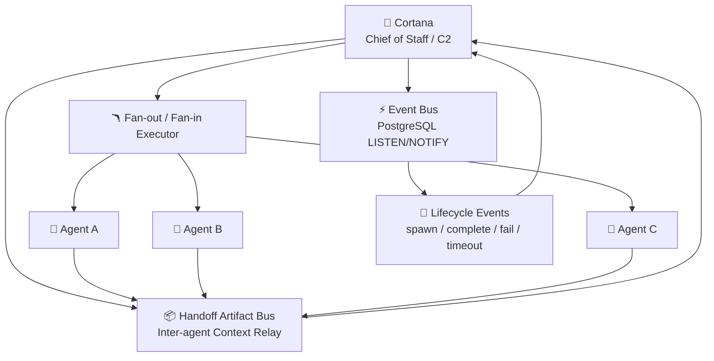
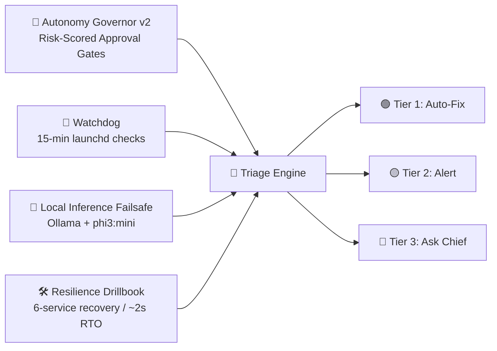
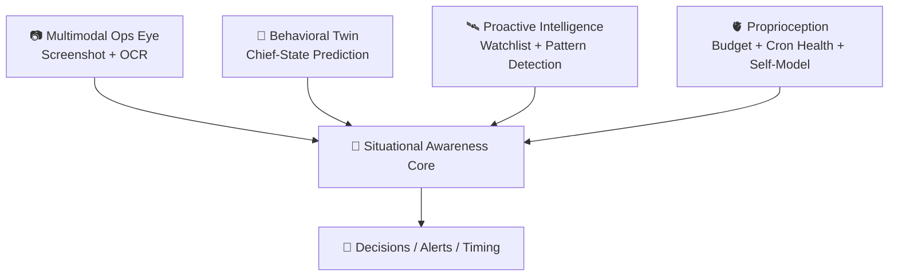
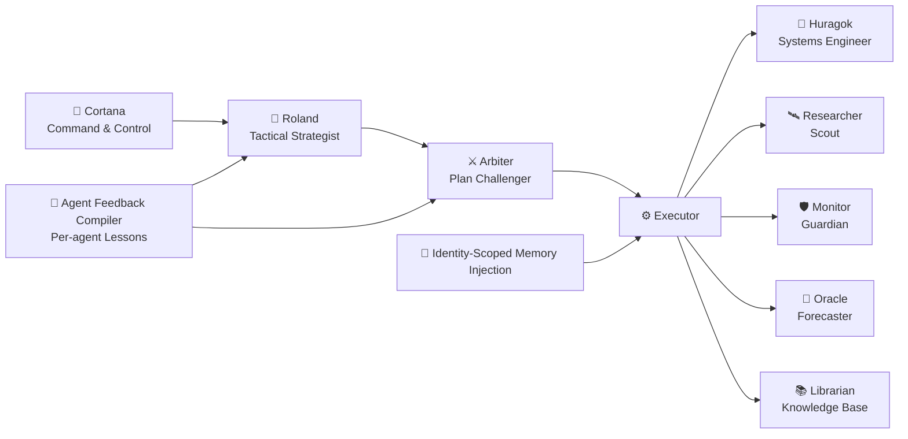

# Cortana Workspace (`~/clawd`)

This is Cortana’s **command brain**: memory, policy, orchestration, cron prompts, and internal automation.

If `~/Developer/cortana-external` is the runtime body (services/apps), this repo is the mind.

---

## 🧬 TLDR — Cortana's Architecture

**At a glance:** 50+ PostgreSQL tables • 5 specialized agents • 15+ autonomous tools • 10+ scheduled services (launchd + cron) • Local inference fallback • Zero-API embedding at ~1,400 texts/sec.

### 🧠 The Brain (Memory & Cognition)
Cortana thinks in layers: immediate context for now, session logs for continuity, and vector-backed long-term memory for recall. The memory loop is compressed daily, embedded locally, and prewarmed before the day starts.



### 💪 The Nervous System (Communication & Coordination)
Cortana sits at command-and-control center, routing signals between agents and systems. Events flow through a durable bus, while parallel workflows fan out and converge with structured handoffs.



### 🛡️ The Immune System (Self-Healing & Safety)
When things drift, Cortana doesn't panic—she triages. Risk gates, watchdogs, local fallback inference, and recovery playbooks enforce a tiered response: auto-fix first, then alert, then escalate for approval.



### 👁️ The Senses (Awareness & Perception)
Cortana continuously senses both machine state and human context. Vision, pattern models, proactive watchlists, and internal self-health telemetry combine into situational awareness.



### ⚔️ The Covenant (Agent Team)
Five specialized agents execute as a coordinated strike team. Cortana orchestrates a Roland → Arbiter → Executor loop, injects role-scoped memory, and continuously compiles lessons back into future runs.



---

## 1) What Cortana is

Cortana is Hamel’s **AI chief of staff** in a Halo-inspired partnership model:
- Hamel executes in the field
- Cortana handles coordination, memory, prioritization, and systems intelligence
- Work is routed through a Covenant-style specialist team (Huragok/Researcher/Monitor/Oracle/Librarian)

Core mission: compound **Time, Health, Wealth, Career**.

---

## 2) Architecture overview

### Core stack
- **OpenClaw**: agent runtime, cron scheduler, sub-agent orchestration
- **PostgreSQL (`cortana`)**: event/memory/task/state source of truth
- **Covenant agents**: role-routed sub-agents for execution
- **Heartbeat system**: periodic lightweight checks + proactive actions (`HEARTBEAT.md`)

### Runtime split
- `~/clawd` (this repo): policy, memory, prompts, tools, docs
- `~/Developer/cortana-external`: Go APIs, Mission Control app, backtester, watchdog

---

## 3) Repo layout (verified)

```text
~/clawd
├── AGENTS.md, SOUL.md, USER.md, IDENTITY.md
├── README.md, TOOLS.md, MEMORY.md, HEARTBEAT.md
├── config/cron/jobs.json
├── covenant/                    # Covenant framework + role docs
├── skills/                      # installed local skills
├── tools/                       # internal automation tools
├── memory/, knowledge/, docs/
├── proprioception/, immune-system/, cortical-loop/, sae/
└── migrations/, reports/, projects/, tmp/
```

---

## 4) Tools in this repo (`tools/`) — key operators

### Required core tool families
- `tools/market-intel/` — unified market + sentiment snapshot pipeline
- `tools/gmail/` — email triage/autopilot scripts
- `tools/task-board/` — task queue, auto-executor, stale detection cleanup, and state enforcement tooling
- `tools/memory/` — ingestion + quality gates + consolidation helpers
- `tools/reflection/` — reflection and repeated-correction analysis
- `tools/proactive/` — cross-signal proactive detection/calibration
- `tools/alerting/` — cron preflight + alert playbooks (includes `cost-breaker` runaway-session circuit breaker)
- `tools/trade-alerts/` — Alpaca-backed trade alert pipeline and execution wiring
- `tools/earnings-alert/` — earnings checker/calendar scripts wired into morning brief + cron
- `tools/auto-chain/` — automatic follow-up task chaining rules engine
- `tools/health/` — self-diagnostic and platform health scripts (`self-diagnostic.sh`)
- `tools/spawn/` — sub-agent spawn pre-flight validator

### Additional major tool groups present
`behavioral-twin`, `briefing`, `covenant`, `email`, `embeddings`, `event-bus`, `failsafe`, `fitness`, `governor`, `guardrails`, `health`, `market-intel`, `mortgage`, `ops-eye`, `policy`, `portfolio`, `resilience`, `self-upgrade`, `tracing`, `trading`, `travel`, and others under `tools/`.

---

## 5) Installed skills (`skills/`) — verified

- `auto-updater`
- `bird`
- `caldav-calendar`
- `clawddocs`
- `clawdhub`
- `fitness-coach`
- `gog`
- `markets`
- `news-summary`
- `process-watch`
- `stock-analysis`
- `telegram-usage`
- `weather`

---

## 6) Covenant framework

Covenant docs live in `covenant/`:
- `covenant/README.md`
- `covenant/CONTEXT.md`
- `covenant/CORTANA.md`
- Role folders: `huragok/`, `librarian/`, `monitor/`, `oracle/` (each with `AGENTS.md` + `SOUL.md`)

Operational routing contract (from AGENTS/MEMORY):
- **Huragok**: systems/infra/tooling
- **Researcher**: research/deep dives
- **Monitor**: monitoring/patterns/health
- **Oracle**: forecasting/strategy/risk
- **Librarian**: docs/README/knowledge structure

---

## 7) Cron jobs and scheduler wiring

### Source of truth
- **Repo file:** `/Users/hd/clawd/config/cron/jobs.json`
- **Runtime path:** `~/.openclaw/cron/jobs.json`

Design intent is repo-managed cron definitions with runtime mapping via symlink. Verify with:
```bash
ls -l ~/.openclaw/cron/jobs.json
```

### Major enabled cron groups (from `jobs.json`)
- Daily briefs: Morning Brief, Stock Market Brief, Fitness Morning/Evening
- Newsletter checks: real-time + weekday digest
- Calendar reminders
- Fitness + Tonal + X session health checks
- CANSLIM intraday scan + weekly Monday market brief
- SAE world-state + cross-domain reasoner
- Memory consolidation + cleanup + weekly reflection/status
- Proprioception: health, budget/self-model, efficiency
- Immune scan + mission advancement + bedtime/weekend sleep checks

---

## 8) Database (`cortana_*`) summary

PostgreSQL path:
```bash
export PATH="/opt/homebrew/opt/postgresql@17/bin:$PATH"
```

### Core ops
`cortana_events`, `cortana_feedback`, `cortana_patterns`, `cortana_tasks`, `cortana_epics`, `cortana_upgrades`, `cortana_watchlist`

### SAE + insights + wake logic
`cortana_sitrep`, `cortana_insights`, `cortana_wake_rules`, `cortana_chief_model`, `cortana_feedback_signals`

### Covenant + coordination
`cortana_covenant_runs`, `cortana_handoff_artifacts`, `cortana_event_bus_events`, `cortana_trace_spans`, `cortana_decision_traces`

### Memory system
`cortana_memory_semantic`, `cortana_memory_episodic`, `cortana_memory_procedural`, `cortana_memory_archive`, `cortana_memory_consolidation`, `cortana_memory_ingest_runs`, `cortana_memory_provenance`, `cortana_memory_recall_checks`

### Proprioception + budget + throttle
`cortana_self_model`, `cortana_budget_log`, `cortana_cron_health`, `cortana_tool_health`, `cortana_throttle_log`, `cortana_token_ledger`

### Immune/autonomy/policy quality
`cortana_immune_incidents`, `cortana_immune_playbooks`, `cortana_policy_decisions`, `cortana_policy_overrides`, `cortana_policy_budget_usage`, `cortana_action_policies`, `cortana_quality_scores`, `cortana_response_evaluations`, `cortana_workflow_checkpoints`, `cortana_chaos_runs`, `cortana_chaos_events`, `cortana_autonomy_incidents`, `cortana_autonomy_scorecard_snapshots`

---

## 9) Services and external dependencies

From this repo’s perspective, key local services are:
- **Fitness service**: `http://127.0.0.1:3033` (hosted in `cortana-external`)
- **Watchdog LaunchAgent**: `com.cortana.watchdog` (script in `~/Developer/cortana-external/watchdog/watchdog.sh`, every 15 min)
- **OpenClaw browser CDP**: `127.0.0.1:18800`

---

## 10) Key config files

- `AGENTS.md` — operational constitution + delegation/branch hygiene rules
- `SOUL.md` — persona and response style
- `USER.md` — Hamel context/preferences
- `MEMORY.md` — curated long-term memory
- `HEARTBEAT.md` — heartbeat rotation and proactive checks
- `docs/heartbeat-sql-reference.md` — canonical heartbeat SQL templates/reference
- `TOOLS.md` — machine-specific runtime notes and symlink registry
- `config/cron/jobs.json` — cron definitions
- `memory/` — daily memory logs

---

## 11) Symlinks (repo → runtime mappings)

Documented mapping:
- `~/.openclaw/cron/jobs.json` ↔ `/Users/hd/clawd/config/cron/jobs.json`

Policy: any repo/runtime symlink must be listed in `TOOLS.md` and referenced here.

---

## 12) Git workflow + branch hygiene (mandatory)

### For this repo
```bash
git checkout main
git pull
# create branch only after main is fresh (if branching)
```

Rules:
- Never branch from stale feature branches
- Keep docs synced with shipped changes
- Commit/push immediately after meaningful updates
- Treat git as the primary source of truth

---

## 13) Recent major additions

- **Auto-chain rules engine** (`tools/auto-chain/`) for automatic task follow-up chaining (**#40**)
- **Cost breaker** (`tools/alerting/cost-breaker`) runaway session circuit breaker (**#38**)
- **gog OAuth health** cron-safe refresh health script (**#37**)
- **Task board stale detector** with auto-cleanup + audit events (**#36**)
- **Tools audit** inventory of tool scripts and references (**#35**)
- **Heartbeat SQL reference** moved to `docs/heartbeat-sql-reference.md` (**#34**)
- **Meta-monitor + earnings-alert merge** completed (PRs **#31, #33, #39**)
- **Spawn pre-flight validator** for sub-agent launch safety (**#30**)
- **Doc gardener** automated documentation maintenance workflow (**#29**)
- **Self-diagnostic** script at `tools/health/self-diagnostic.sh` for Cortana health (**#28**)
- **Task board state enforcer** CLI for atomic state transitions (**#32**)
- **Pytest suite** for critical Python tool coverage
- **Earnings alert system** (checker + calendar scripts) integrated with morning brief and cron
- **Cron optimization** via precompute scripts and leaner prompts for slow jobs
- **Research recommendations** added to task importer outputs
- **Agent review chain** protocol for sub-agent output review and quality gate
- **AGENTS.md refactor** to slim pointer/harness pattern
- **Market-intel pipeline** (`tools/market-intel`) integrating quote + X sentiment + portfolio overlay
- **X/Twitter integration hardening** (`bird`, auth health checks, watchdog coverage)
- **Task board system** (`cortana_tasks`/`cortana_epics`, auto-executor, integrity audits)
- **Covenant communication upgrades** (handoff artifact bus, lifecycle eventing, identity-scoped memory injection, fan-out/fan-in execution)
- **Vector + local embeddings stack** (`pgvector`, fastembed, semantic memory acceleration)
- **Proprioception + immune expansion** (budget/throttle, risk gates, auto-heal workflows)

---

## 14) Quick operator checks

```bash
# Cron health
openclaw cron list

# DB reachable
export PATH="/opt/homebrew/opt/postgresql@17/bin:$PATH"
psql cortana -c "select now();"

# Fitness service health
curl -s http://127.0.0.1:3033/tonal/health

# Watchdog loaded
launchctl list | grep com.cortana.watchdog
```

---

Last refreshed: **2026-02-26** (README + tooling/test cross-check)