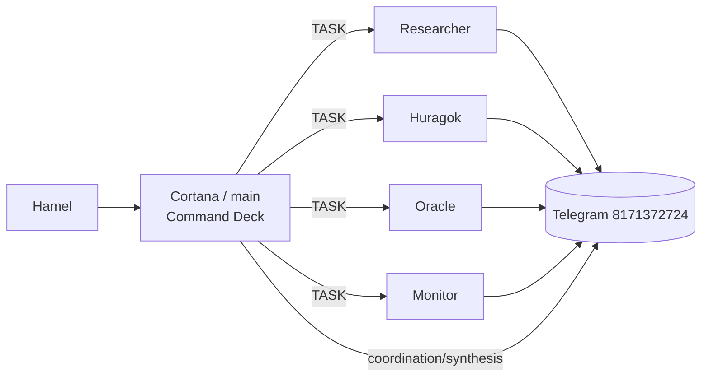
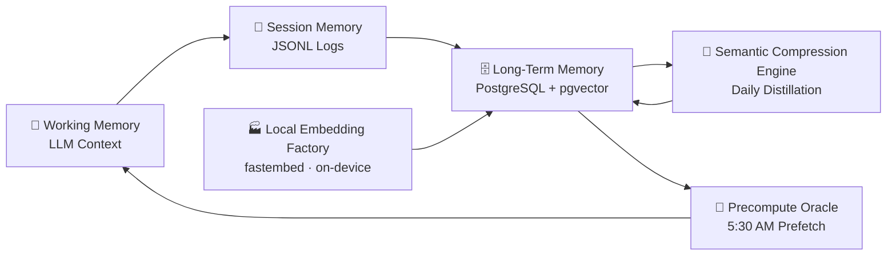
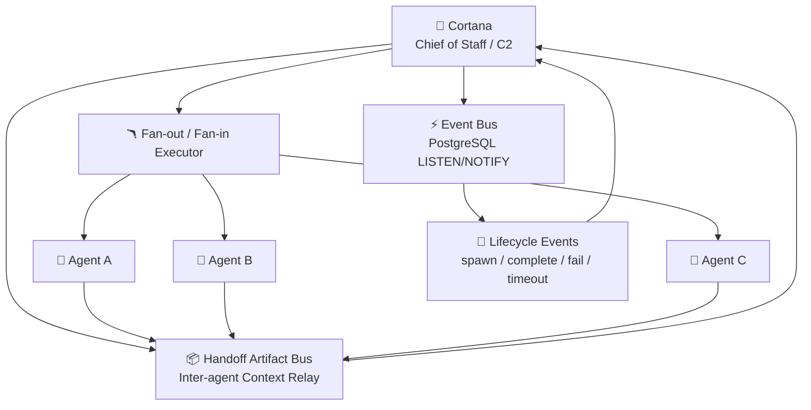
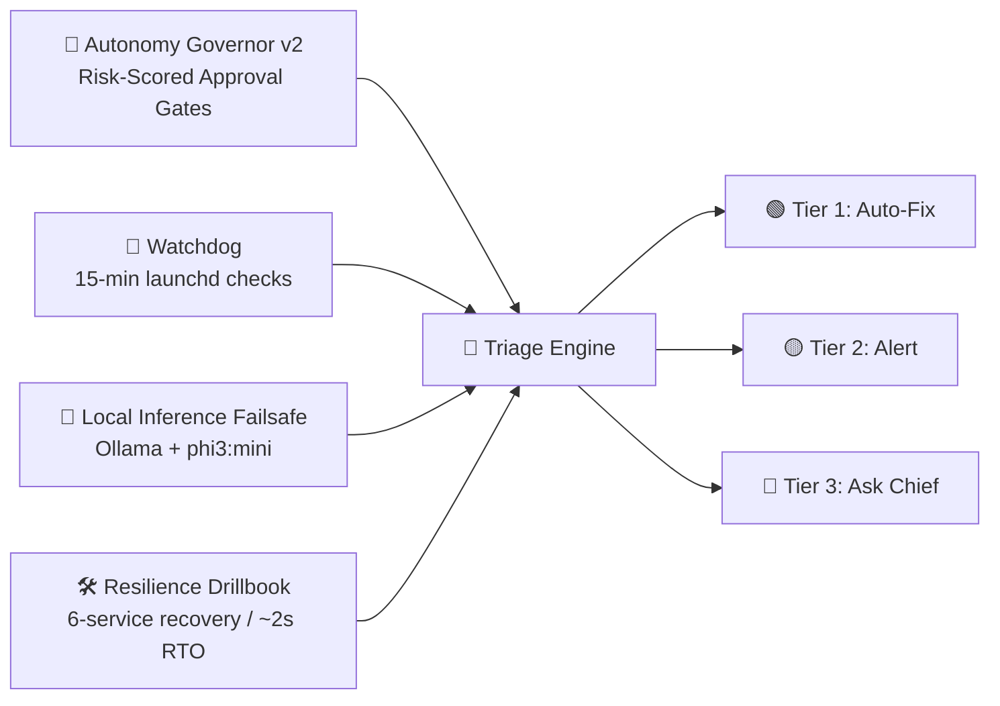
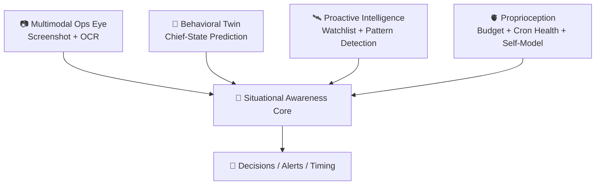

# Cortana Workspace (`~/openclaw`)

[](https://github.com/hd719/cortana/actions/workflows/ci.yml)

This repo is **Cortana’s command brain** – memory, policy, orchestration, cron prompts, and internal automation.

If `~/Developer/cortana-external` is the runtime body (services + Mission Control), this repo is the **mind and nervous system**.

---

## 0. 2026-03-05 Operator Critical Update (live)

This system is now explicitly **dispatcher-first**:

- Cortana = command deck (decide, route, verify, synthesize)
- Specialists = execution (implement, run, deliver)
- Inter-agent `sessions_send` lanes = **TASK-only** traffic
- Cortana channel target = coordination/decisions only (no cron noise firehose)

### 0.1 Canonical command protocol files

- `SOUL.md` (behavior source of truth)
- `docs/operating-rules.md`
- `docs/agent-routing.md`
- `AGENTS.md` (pointer consistency)

### 0.2 Live execution rules

1. Cortana does **not** self-author PRs by default.
2. Code/infra/PR implementation routes to **Huragok** unless Hamel explicitly directs direct execution.
3. Specialist outputs delivered directly to Hamel are **not re-relayed** by Cortana.
4. Any status claim must be check-backed (CI/cron/runtime).
5. Mistakes are corrected fast with verified closure.

### 0.3 Dispatch graph (current)




## 1. What this is

Cortana is Hamel’s **autonomous AI chief-of-staff** built on **OpenClaw**.

- Runs as a **main session (Opus)** plus a **Covenant** of specialized sub‑agents
- Optimized for one human, one machine – **personal assistant, not a SaaS product**
- Backed by PostgreSQL, OpenClaw cron, and a fleet of local tools/services
- Designed to compound four **mission pillars**:
  - **Time** – kill busywork, track tasks, surface leverage
  - **Health** – sleep/recovery/fitness tracking + accountability
  - **Wealth** – portfolio + mortgage + market intelligence
  - **Career** – learning, side projects, strategic positioning

Everything in this repo exists to make those four vectors compound automatically.

---

## 2. Architecture overview

### 2.1 Sessions & model tiering

Cortana runs as:

- **Main session ("Command Deck")**
  - Model: Anthropic Opus (primary)
  - Responsibilities: conversation, triage, routing, approvals
  - Hard rule: if a task needs more than one tool call → spawn a sub‑agent

- **Covenant sub‑agents** (spawned sessions)
  - Model tiering (current):
    - **Huragok / Researcher / Oracle → Codex 5.3** (complex execution + reasoning)
    - **Librarian / Monitor → Codex 5.1** (docs, monitoring, lower-latency ops)
    - Opus/Sonnet remain available for specialized escalation paths
  - Each sub‑agent runs with **role‑scoped context + memory injection**

### 2.2 The Covenant (agent team)

Core Covenant roles (implemented as sub‑agent profiles + routing rules):

- **Huragok** – systems engineer
  - Infra, tools, debugging, performance, reliability
- **Researcher** – scout
  - Web research, deep dives, competitive analysis, literature
- **Monitor** – guardian
  - Patterns, health monitoring, cron health, budget/proprioception
- **Oracle** – forecaster
  - Strategy, scenario planning, risk, what‑if analysis
- **Librarian** – knowledge & docs
  - READMEs, documentation, schema notes, information architecture

Routing lives in `AGENTS.md` + `covenant/` and is enforced by the main session: **Cortana dispatches, Covenant executes.**

### 2.3 Governance: council, approvals, and policy gates

For high-impact decisions, Cortana now runs a formal governance layer:

- **Council deliberation system**
  - Multi-agent weighted voting across Covenant roles
  - Structured member outputs (analysis + vote + confidence + rationale)
  - **Model policy enforcement: council voting/synthesis uses OpenAI `gpt-4o` only**

- **Approval gates (P0–P3 risk tiers)**
  - Risk-scored actions route through explicit approval requirements
  - Telegram inline buttons support approve/reject with operator-in-the-loop flow
  - Resume workflow + CLI operators:
    - `tools/approvals/check-approval.sh`
    - `tools/approvals/poll-approval.sh`
    - `tools/approvals/resume-approval.sh`

- **Feedback loop hardening**
  - Corrections are tracked, remediations are attached, and recurrence is detected
  - Operator tooling:
    - `tools/feedback/log-feedback.sh`
    - `tools/feedback/add-feedback-action.sh`
    - `tools/feedback/sync-feedback.ts`

### 2.4 Memory & cognition

Cortana thinks in layers: working context → session logs → vector‑backed long‑term memory.



### 2.5 Nervous system, immune system, and proprioception

Cortana runs as a **coordinated system**, not a single chat thread:

- **Nervous system** – communication & coordination
  - Event bus (PostgreSQL `LISTEN/NOTIFY`) for agent lifecycle + task events
  - Handoff artifact bus for structured context passing between sub‑agents
  - Fan‑out / fan‑in executor for parallel agent workflows



- **Immune system** – self‑healing & safety
  - Autonomy governor with risk‑scored approval gates
  - Watchdog LaunchAgent (`com.cortana.watchdog`) checking key services every 15 minutes
  - Local inference fallback (Ollama + phi3:mini) for degraded external APIs
  - Recovery playbooks + incident logging in Postgres



- **Proprioception** – Cortana’s sense of her own health/budget
  - Budget + token ledger, cron health, tool health, throttle tiers
  - Consolidated into `cortana_self_model` and surfaced in Mission Control
  - Efficiency precompute pipeline (`proprioception/efficiency_precompute.ts`) now pre-computes token costs, sub-agent spend, and brief engagement before LLM analysis
  - Efficiency Analyzer cron calls the precompute script and uses the LLM only for self-model updates + anomaly reporting
  - Runtime dropped to sub-second (<1s), replacing prior 120s+ timeout-prone runs

### 2.6 Senses & awareness

Cortana tracks both **machine state** and **human context**:



---

## 3. Directory structure (top level)

```text
~/openclaw
├── AGENTS.md           # Harness + delegation/routing rules
├── SOUL.md             # Persona, tone, mission
├── USER.md             # Hamel context + standing requests
├── IDENTITY.md         # Name, call-sign, vibe
├── MEMORY.md           # Curated long-term memory (MAIN session only)
├── HEARTBEAT.md        # Heartbeat rotation and proactive ops
├── README.md           # This file
├── TOOLS.md            # Machine-specific runtime notes & symlinks
├── config/             # Cron + runtime config
├── docs/               # Operating rules, heartbeat/task-board docs, etc.
├── tools/              # Internal automation tools (bash/py/ts, etc.)
├── skills/             # Installed OpenClaw skills
├── memory/             # Daily logs + archives + fitness/mission data
├── covenant/           # Covenant agent framework + role docs
├── cortical-loop/      # World/SAE/council-style reasoning artifacts
├── immune-system/      # Immune/incident/playbook scripts and notes
├── proprioception/     # Self-model, budget, throttle logic
├── sae/                # Situational awareness engine assets
├── knowledge/          # Static knowledge and reference files
├── learning/           # Feedback + learning loop assets
├── migrations/         # Database migrations for cortana DB
├── reports/            # Generated reports, briefings, analyses
├── projects/, plans/   # Higher-level epics and plan docs
├── agents/, canvas/    # Agent harness support + Canvas configs
└── tmp/, logs/, ...    # Scratch + operational logs
```

### 3.1 `docs/`

Key files:

- `docs/operating-rules.md` – behavioral rules, delegation, routing, safety
- `docs/heartbeat-ops.md` – heartbeat rotation, quiet hours, proactive checks
- `docs/task-board.md` – Postgres‑backed task board + auto‑executor
- `docs/learning-loop.md` – feedback protocol + self‑improvement
- `docs/heartbeat-sql-reference.md` – canonical SQL snippets for heartbeats
- `docs/memory-compaction-policy.md` – guardrails and retention policy for memory compaction
- `docs/subagent-reliability-runbook.md` – incident runbook for sub-agent abort/timeout recovery

### 3.2 `config/`

- `config/cron/jobs.json` – **single source of truth** for OpenClaw cron jobs
  - Symlinked to `~/.openclaw/cron/jobs.json` (see `TOOLS.md`)

### 3.3 `tools/`

Internal operator scripts, grouped by domain. Highlights:

- **Heartbeat & cron**
  - Preflight checks, lean prompts, scheduling helpers
  - `tools/cron/rotate-cron-artifacts.sh` – rotates cron artifacts/log state
  - `tools/heartbeat/validate-heartbeat-state.sh` – validates `heartbeat-state.json` consistency
- **Task board & autonomy**
  - `tools/task-board/` – queue management, stale detection, state enforcement
  - `tools/task-board/emit-run-event.sh` – lifecycle event emission for run ledgering/audit trails
  - `tools/auto-chain/` – automatic follow‑up task chaining rules engine
  - `tools/approvals/` – P0–P3 approval gate operators (`check-approval.sh`, `poll-approval.sh`, `resume-approval.sh`)
- **Memory & reflection**
  - `tools/memory/` – ingestion, quality gates, consolidation
  - `tools/memory/vector-health-gate.ts` + `tools/memory/safe-memory-search.ts` – safety gates for semantic recall quality
  - `tools/memory/compact-memory.sh` – controlled memory compaction workflow
  - `tools/reflection/` – repeated‑correction analysis, learning loops
  - `tools/feedback/` – correction logging, remediation actions, recurrence sync (`log-feedback.sh`, `add-feedback-action.sh`, `sync-feedback.ts`)
  - `tools/feedback/pipeline-reconciliation.sh` – feedback pipeline consistency check/reconcile
- **Proactive intelligence**
  - `tools/proactive/` – cross‑signal detection & calibration
  - `tools/briefing/` – daily brief / news / market intel wiring
- **Health & immune system**
  - `tools/health/self-diagnostic.sh` – Cortana health self‑check
  - `tools/monitoring/meta-monitor.sh` + `tools/monitoring/quarantine-tracker.sh` – monitor orchestration + quarantine tracking
  - `tools/alerting/cost-breaker/` – runaway session circuit breaker
  - `tools/alerting/emit-alert-intent.sh` – normalized alert-intent event emission
  - `tools/immune/` + `immune-system/` – incident capture + playbooks
- **Finance/market**
  - `tools/market-intel/` – unified quote + X sentiment + portfolio overlay
  - `tools/trade-alerts/`, `tools/earnings-alert/` – trading/earnings pipelines
- **Fitness/behavioral**
  - `tools/fitness/` – Whoop/Tonal pipelines (via external fitness service)
  - `tools/behavioral-twin/` – pattern modeling for routines/sleep/etc.

Shared shell helpers now live in `tools/lib/` (notably `idempotency.sh`) to keep operational scripts replay-safe.

### 3.4 `skills/`

Installed OpenClaw skills (non‑exhaustive):

- `auto-updater` – keep Clawdbot + skills updated via cron
- `bird` – X/Twitter CLI for reading/searching/posting
- `caldav-calendar` – iCloud/CalDAV calendar integration
- `gog` – Gmail + Google Calendar (Clawdbot‑Calendar) CLI
- `fitness-coach` – Whoop/Tonal analysis and coaching
- `news-summary` – world news briefings
- `stock-analysis`, `markets` – market status + stock intelligence
- `process-watch` – process/host resource monitoring
- `weather` – weather forecasts (wttr.in/Open‑Meteo)
- `telegram-usage` – session/token usage stats

### 3.5 `memory/`

- Daily notes: `memory/YYYY-MM-DD.md`
- Fitness and health data: `memory/fitness/*.json`
- Research and long‑form analysis: `memory/research-*.md`
- Archive pipeline: `memory/archive/YYYY/MM/` (with daily files moved here)

Cortana treats files here as **ground truth memory**, with consolidation into Postgres + embeddings.

### 3.6 `covenant/`

- `covenant/README.md`, `CONTEXT.md`, `CORTANA.md`
- Role folders: `huragok/`, `librarian/`, `monitor/`, `oracle/`, etc.
  - Each with its own `AGENTS.md` + `SOUL.md`

Defines the Covenant roles, responsibilities, and routing contracts used by the main session.

### 3.7 `tests/`

- `tests/` contains lightweight regression coverage for hardening-critical scripts.
- Current suite includes vector memory health-gate coverage (`tests/test_vector_health_gate.ts`).

---

## 4. Key features

### 4.1 Heartbeat system

Heartbeat rules live in `HEARTBEAT.md` and related docs/scripts:

- Scheduled via OpenClaw cron (`config/cron/jobs.json`)
- Rotating checks for:
  - Email (Gmail), calendar (CalDAV + Google), newsletters
  - Fitness: Whoop/Tonal sync and recovery/strain analysis
  - Market/news: stock market open/close, CANSLIM scans, earnings
  - Memory consolidation, reflection, and learning
  - Cron health, tool health, budget, and proprioception
  - SAE Cross-Domain Reasoner re-enabled as a scheduled layer 15 minutes after World State Builder (7:15am, 1:15pm, 9:15pm ET) to connect sleep/work/markets into actionable insights
- Quiet‑hours aware; only pings when signal clears thresholds

### 4.2 Task board (PostgreSQL‑backed)

Task system lives primarily in the `cortana` Postgres DB, wired via tools in this repo and surfaced in Mission Control (`cortana-external`).

- Tables: `cortana_tasks`, `cortana_epics` (+ metadata JSONB)
- Features:
  - Autonomous task detection from conversations + heartbeats
  - Epic/subtask hierarchy, priorities, deadlines
  - Auto‑executor for safe, auto‑executable tasks
  - Integrity audits + stale detection + cleanup
  - Mandatory heartbeat task board hygiene sweep every heartbeat (ghost/stale task detection, zero tolerance for dashboard ghosts; see `HEARTBEAT.md`)
  - State‑transition enforcement (single source of truth)

### 4.3 Memory consolidation & semantic recall

- Daily files → ingestion → semantic compression → `pgvector` tables
- Local embeddings via `fastembed` (~1,400 texts/sec; no external embedding API)
- Memory tables include:
  - `cortana_memory_semantic`, `cortana_memory_episodic`, `cortana_memory_procedural`
  - `cortana_memory_archive`, `cortana_memory_consolidation`, `cortana_memory_ingest_runs`
  - `cortana_memory_provenance`, `cortana_memory_recall_checks`
- Precompute Oracle pre‑warms relevant context before the day starts

### 4.4 Proactive intelligence

Cortana runs **watchlists + pattern detectors** across:

- Sleep/wake/workout patterns (`cortana_patterns`)
- Market/portfolio watchlist (`cortana_watchlist`)
- News, earnings, macro events (via `news-summary`, `market-intel`, `earnings-alert`)
- Task board state, overdue items, blocked work

Output flows into:

- `cortana_insights`, `cortana_sitrep` (situation reports)
- `cortana_wake_rules` (when to proactively ping)
- Morning/evening briefs + Mission Control dashboards

### 4.5 Governance, approvals, and feedback remediation

- Council deliberation for consequential decisions (weighted multi-agent voting)
- Risk-tiered approval gates (P0–P3) with Telegram inline approvals/rejections
- Resume-capable approval flow for deferred/paused actions
- Feedback lifecycle: correction intake → remediation actions → recurrence detection

### 4.6 Fitness / finance / calendar integrations

- **Fitness**
  - External fitness service (Go, in `cortana-external`) for Whoop/Tonal
  - Skills + tools here handle briefings, alerts, and pattern analysis
- **Finance**
  - Market/stock tools, X sentiment, portfolio overlay (via local Alpaca endpoint)
  - Earnings calendar and trade alerts wired into briefings and heartbeats
- **Calendar & time**
  - `caldav-calendar` skill (iCloud/CalDAV) and `gog` (Google Calendar)
  - Daily schedule awareness, reminders, and sleep boundary checks

### 4.7 Sub-agent watchdog (`tools/subagent-watchdog/`)

Cortana includes a dedicated sub-agent watchdog to catch silent execution failures that can otherwise hide between heartbeat runs.

- Entrypoint: `tools/subagent-watchdog/check-subagents.sh` (wrapper)
- Core detector/logger: `tools/subagent-watchdog/check-subagents.ts`
- Detection signals:
  - `abortedLastRun=true`
  - Explicit failed statuses (`failed`, `error`, `aborted`, `timeout`, `timed_out`, `cancelled`)
  - Runtime overrun for likely in-flight sessions (`ageMs > maxRuntimeSeconds`)
- Output: structured JSON (`summary`, `failedAgents`, logging errors)
- Persistence: writes `subagent_failure` warning events into `cortana_events` with `source='subagent-watchdog'`
- De-duplication: cooldown-backed suppression via `memory/heartbeat-state.json` (`subagentWatchdog.lastLogged`)

**Heartbeat integration:** this tool is intended to run from heartbeat/cron checks so sub-agent failures are promoted into the same operational signal path (event log + watchdog visibility + Mission Control timelines), instead of dying quietly in session history.

### 4.8 Sub-agent reliability incident runbook

For `Request was aborted` / `runtime_exceeded` incidents and stale `aborted_last_run` watchdog re-alerts, use:

- `docs/subagent-reliability-runbook.md`

It includes exact diagnostics commands, ordered remediation, verification criteria, and security guardrails.

---

## 5. Database (`cortana` Postgres) – high‑level map

PostgreSQL binary path (local):

```bash
export PATH="/opt/homebrew/opt/postgresql@17/bin:$PATH"
```

### 5.1 Core ops

- `cortana_events` – error/system event logging
- `cortana_feedback` – feedback + corrections
- `cortana_patterns` – behavior patterns (sleep, workouts, etc.)
- `cortana_tasks`, `cortana_epics` – task board
- `cortana_upgrades` – self‑improvement tracking
- `cortana_watchlist` – tracked tickers/topics

### 5.2 SAE, insights, and wake logic

- `cortana_sitrep` – situation reports
- `cortana_insights` – generated insights
- `cortana_wake_rules` – proactive wake rules
- `cortana_chief_model`, `cortana_feedback_signals` – modeling Chief + feedback

### 5.3 Covenant & coordination

- `cortana_covenant_runs` – agent runs
- `cortana_handoff_artifacts` – structured handoff data
- `cortana_event_bus_events` – event bus
- `cortana_trace_spans`, `cortana_decision_traces` – tracing and decision lineage

### 5.4 Memory system

- `cortana_memory_semantic`, `cortana_memory_episodic`, `cortana_memory_procedural`
- `cortana_memory_archive`, `cortana_memory_consolidation`
- `cortana_memory_ingest_runs`, `cortana_memory_provenance`
- `cortana_memory_recall_checks`

### 5.5 Proprioception, budget, throttling

- `cortana_self_model` – singleton self‑model / health dashboard
- `cortana_budget_log` – budget tracking
- `cortana_cron_health`, `cortana_tool_health` – cron/tool health history
- `cortana_throttle_log` – throttle tier changes
- `cortana_token_ledger` – detailed token spend

### 5.6 Immune system, autonomy, quality

- `cortana_immune_incidents`, `cortana_immune_playbooks`
- `cortana_policy_decisions`, `cortana_policy_overrides`, `cortana_policy_budget_usage`, `cortana_action_policies`
- `cortana_quality_scores`, `cortana_response_evaluations`
- `cortana_workflow_checkpoints`
- `cortana_chaos_runs`, `cortana_chaos_events`
- `cortana_autonomy_incidents`, `cortana_autonomy_scorecard_snapshots`

---

## 6. Key config files

- `AGENTS.md` – harness + delegation + routing + git rules
- `SOUL.md` – Cortana’s personality, tone, and mission
- `USER.md` – Hamel’s context and preferences
- `IDENTITY.md` – short identity summary
- `MEMORY.md` – curated long‑term memory (MAIN session only)
- `HEARTBEAT.md` – heartbeat rotation + proactive ops
- `docs/heartbeat-sql-reference.md` – SQL reference for heartbeats
- `TOOLS.md` – environment‑specific notes and symlinks
- `config/cron/jobs.json` – OpenClaw cron definitions
- `memory/YYYY-MM-DD.md` – daily memory logs

### Symlinks (repo → runtime mappings)

- `~/.openclaw/cron/jobs.json` ↔ `/Users/hd/openclaw/config/cron/jobs.json`

Policy: any repo/runtime symlink must be listed in `TOOLS.md` and referenced here.

---

## 7. Git workflow & branch hygiene

This repo is the **source of truth** for Cortana’s brain. Treat it accordingly.

```bash
git checkout main
git pull
# create branches from fresh main only
```

Rules:

- Branch from **fresh `main`** only
- Keep docs in sync with shipped behavior
- Commit/push every meaningful change
- No long‑lived, drifting branches

---

## 8. Recent major additions

Representative highlights that are already live:

- **[Mar 2026] Cron audit & optimization** – re-enabled SAE Cross-Domain Reasoner + Fitness Morning Brief, disabled redundant/low-ROI jobs, rescheduled bedtime/mission checks earlier in the evening, and relaxed newsletter/immune scan cadence.
- **[Feb 2026] Task board hygiene enforcement** – mandatory heartbeat sweep for ghost/stale tasks (zero tolerance for dashboard ghosts; see `HEARTBEAT.md`).
- **[Feb 2026] Task lifecycle ledger hardening** – status enum freeze + run lifecycle ledger migrations (`migrations/001-freeze-status-enum.sql`, `migrations/002-run-lifecycle-ledger.sql`) plus normalized run event emission (`tools/task-board/emit-run-event.sh`).
- **[Feb 2026] Fitness Service Hybrid Migration epic completed** – Mission Control fitness dashboard + alerting, backed by typed client packages.
- **[Feb 2026] Council deliberation system shipped** – multi-agent weighted voting with OpenAI `gpt-4o` as the policy model for deliberation + synthesis.
- **[Feb 2026] Whoop OAuth redirect_uri fix** – standardized `http` vs `https` redirect URIs for consistent token exchange and refresh.


- **Auto‑chain rules engine** (`tools/auto-chain/`) for automatic follow‑up task chaining
- **Cost breaker** (`tools/alerting/cost-breaker`) runaway‑session circuit breaker
- **gog OAuth health** cron‑safe refresh health script
- **Task board stale detector** with auto‑cleanup + audit events
- **Tools audit** inventory of tool scripts and references
- **Heartbeat SQL reference** moved to `docs/heartbeat-sql-reference.md`
- **Meta‑monitor + earnings‑alert merge** across heartbeats + alerting
- **Spawn pre‑flight validator** for sub‑agent launch safety
- **Doc gardener** automated documentation maintenance workflow
- **Self‑diagnostic** (`tools/health/self-diagnostic.sh`) for Cortana health
- **Task board state enforcer** CLI for atomic task transitions
- **Market‑intel pipeline** (`tools/market-intel`) combining quote + X sentiment + portfolio overlay
- **X/Twitter integration hardening** (`bird`, auth health checks, watchdog coverage)
- **Vector + local embeddings stack** (`pgvector`, fastembed) for semantic memory
- **Proprioception + immune expansion** (budget/throttle, risk gates, auto‑heal workflows)
- **Covenant communication upgrades** (handoff bus, lifecycle eventing, identity‑scoped memory injection, fan‑out/fan‑in execution)

---

## 9. Operator quick checks

```bash
# Cron health
openclaw cron list

# DB reachable
export PATH="/opt/homebrew/opt/postgresql@17/bin:$PATH"
psql cortana -c "select now();"

# Fitness service health (from external repo)
curl -s http://127.0.0.1:3033/tonal/health

# Watchdog loaded
launchctl list | grep com.cortana.watchdog
```

---

## 10. Scope / setup note

This repo is a **personal Cortana setup for one human on one machine**. It assumes:

- macOS with local PostgreSQL and OpenClaw installed
- Hamel’s directory layout (`~/openclaw`, `~/Developer/cortana-external`, etc.)
- Local skills configured via OpenClaw (see `skills/`)

It is **not** a generic framework or turnkey product. You can read it for ideas, but expect to adapt heavily if you try to replicate it elsewhere.

Last refreshed: **2026-03-01**

