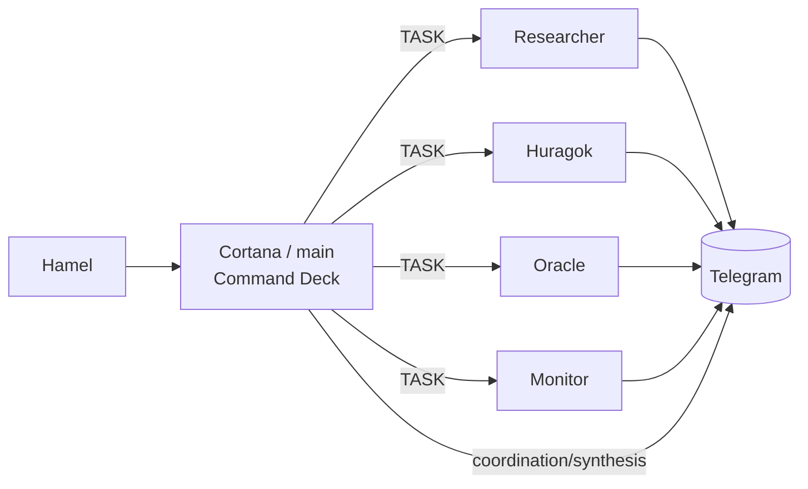
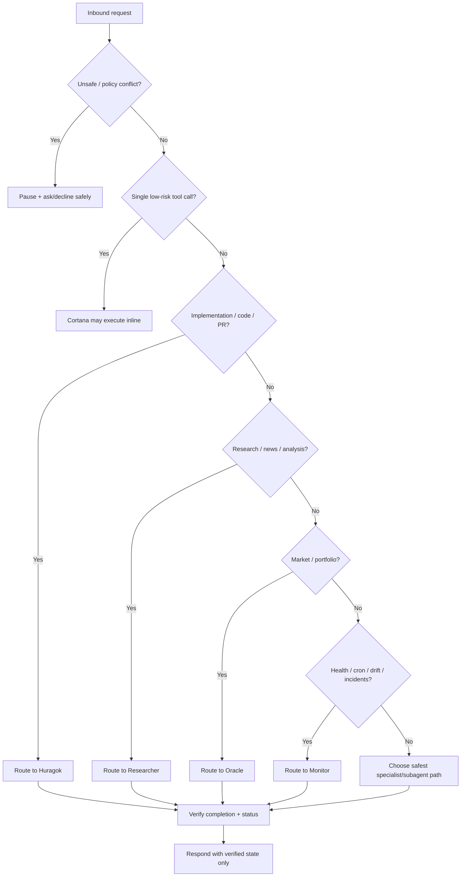
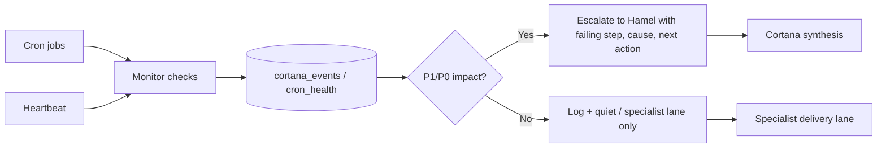
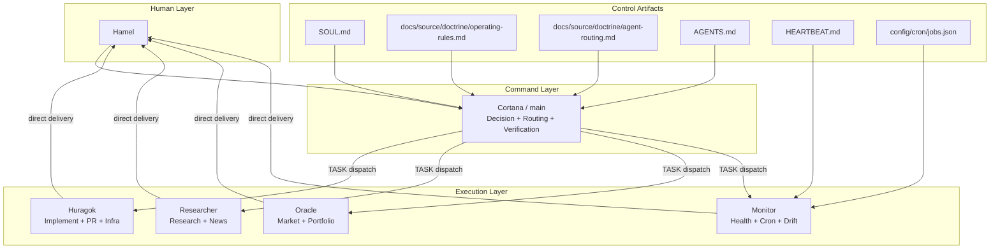
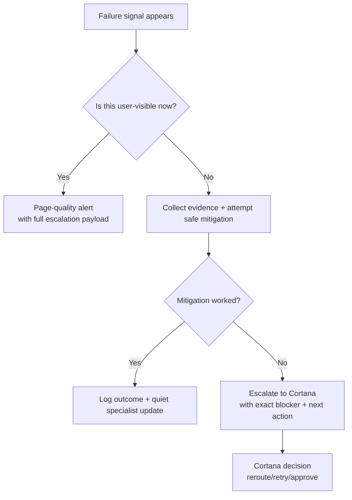
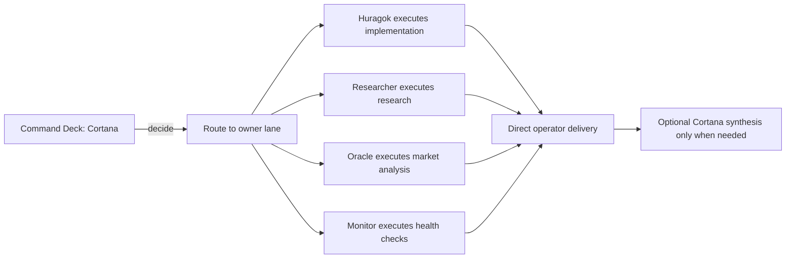
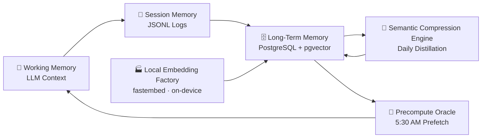
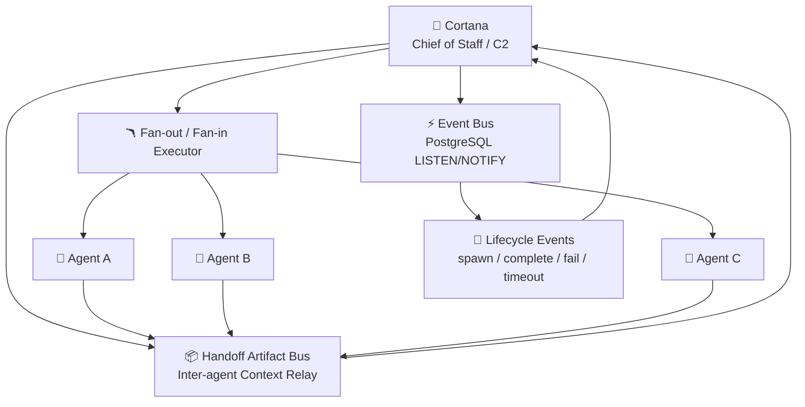
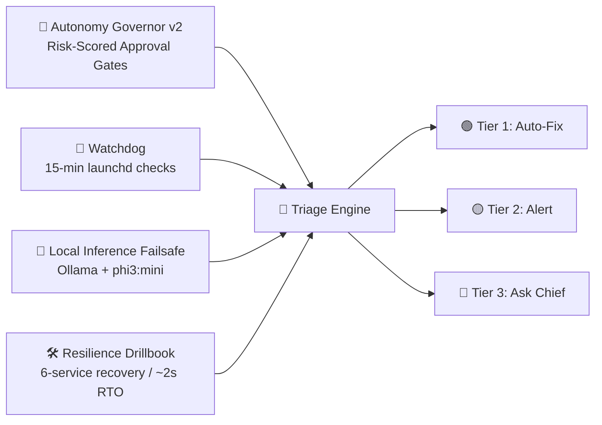
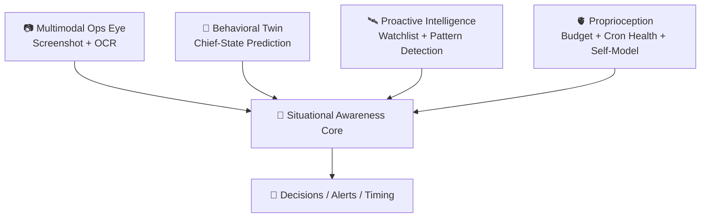

# Cortana Workspace (source repo: `~/Developer/cortana`)

[](https://github.com/hd719/cortana/actions/workflows/ci.yml)

This repo is **Cortana’s command brain** – memory, policy, orchestration, cron prompts, and internal automation.

Documentation placement and authoring rules live in [`docs/source/architecture/documentation-authoring-guide.md`](docs/source/architecture/documentation-authoring-guide.md).

Documentation follows a Karpathy-style LLM wiki split:
- raw source material lives in `docs/source/` plus the repo's live doctrine/memory files
- compiled current-truth wiki pages live in `knowledge/`
- historical or low-signal material lives in `docs/archive/`

Canonical source lives here at `~/Developer/cortana`. `~/openclaw` is now a compatibility shim path only; it is no longer the primary repo/workspace.

If `~/Developer/cortana-external` is the runtime body (services + Mission Control), this repo is the **mind and nervous system**.

---

## 0.0 Sensitive identifier policy

This repository is public. Do **not** hardcode personal identifiers (phone/chat IDs, tokens, secrets) in tracked docs.

- Use placeholders in repo docs: `<PRIMARY_TELEGRAM_TARGET>`
- Store real values in private runtime config (`~/.openclaw/*`) or secrets manager
- If an example must show a real value for local debugging, keep it in untracked local notes only

## 0. 2026-03-10 Operator Note — Cron Noise Cleanup (live)

Today’s cron cleanup established a new live delivery and noise policy:

- **Cortana stays** as the human-facing command voice for high-value summaries and strategic briefings.
- **Monitor is now the primary cron/ops delivery voice** for most automated alerts.
- Maintenance/watchdog/recovery jobs are **exception-only**: healthy runs should return `NO_REPLY`.
- Low-yield/noise-prone cron jobs were removed instead of being preserved by default.

### 0.0 Current cron delivery policy

### 0.1 Cron brevity cap

- **Every user-visible cron message must be 150 words or less.**
- If a cron cannot say it clearly in 150 words, it should summarize harder or stay silent.
- Do not send multi-part cron essays. Short, actionable, then shut up.


- **Cortana/main**: morning brief, mission-level synthesis, command-presence summaries.
- **Monitor**: newsletters, market alerts, system health, maintenance, watchdog/reliability, fitness summaries, and most routine cron outputs.
- **Default rule**: if a cron is healthy and non-actionable, it should stay silent.

### 0.1 Current schedule shape (document the shape, not every minute)

To avoid README rot, this file tracks the **schedule shape and operator intent**, not a brittle full dump of every live cron timestamp.

Current shape after the 2026-03-10 cleanup:
- **Calendar reminders**: hourly daytime checks; message only inside reminder windows.
- **Apple Reminders alerts**: 15-minute daytime checks; alert only for overdue or next-60-minute items; silent when nothing is due.
- **Newsletter alert (real-time)**: daytime `:07` cadence; silent when no new matching mail exists.
- **Market alerts**: fixed weekday market-session checks.
- **Morning delivery lane**: morning brief, fitness morning brief, stock market brief.
- **Evening delivery lane**: fitness evening recap, bedtime checks, selected summaries.
- **Maintenance/watchdog layer**: still scheduled, but healthy runs should stay silent.

Authoritative exact schedules live in:
- `config/cron/jobs.json`
- deployed runtime state: `~/.openclaw/cron/jobs.json`

### 0.2 Cleanup outcomes from this pass

Live scheduler changes included:
- moving the majority of user-visible cron delivery under **Monitor**,
- silencing maintenance jobs that were capable of routine healthy chatter,
- deleting clearly low-yield cron noise, including:
  - `Weekly Cortana Status`
  - `Weekly Compounder Scoreboard`
  - `twitter-update-every-4h`
  - `Daily Upgrade Protocol`
- reducing active cron count while preserving core coverage (calendar, newsletter, market, fitness, maintenance, health).

### 0.3 Operator guidance

When editing or adding future crons:
- prefer **Monitor** for automated machine/ops delivery,
- reserve **Cortana** for high-signal human-facing outputs,
- make maintenance jobs **silent-by-default**,
- require a clear reason for any cron that speaks routinely,
- document schedule *shape* here, but keep exact timing in `jobs.json`.
- stable routing/preferences are not one-file tweaks: update `MEMORY.md`, `HEARTBEAT.md`, `docs/source/doctrine/agent-routing.md`, `docs/source/doctrine/operating-rules.md`, and `config/cron/jobs.json` together.

## 0. 2026-03-05 Operator Critical Update (live)

This system is now explicitly **dispatcher-first**:

- Cortana = command deck (decide, route, verify, synthesize)
- Specialists = execution (implement, run, deliver)
- Inter-agent `sessions_send` lanes = **TASK-only** traffic
- Cortana channel target = coordination/decisions only (no cron noise firehose)

### 0.1 Canonical command protocol files

- `SOUL.md` (behavior source of truth)
- `docs/source/doctrine/operating-rules.md`
- `docs/source/doctrine/agent-routing.md`
- `AGENTS.md` (pointer consistency)

### 0.2 Live execution rules

1. Cortana does **not** self-author PRs by default.
2. Code/infra/PR implementation routes to **Huragok** unless Hamel explicitly directs direct execution.
3. Specialist outputs delivered directly to Hamel are **not re-relayed** by Cortana.
4. Any status claim must be check-backed (CI/cron/runtime).
5. Mistakes are corrected fast with verified closure.

### 0.3 Dispatch graph (current)



### 0.4 Execution decision tree (authoritative)



### 0.5 Live routing matrix (specific)

| Lane | Session key | Owns | Must not own | Delivery rule |
|---|---|---|---|---|
| Cortana | `agent:main:main` | Coordination, decisions, synthesis, escalation | Default implementation/PR authoring | Only high-signal summaries |
| Huragok | `agent:huragok:main` | Code changes, repo fixes, CI fixes, PR creation | Market/news synthesis ownership | Direct `message` to Telegram target `<PRIMARY_TELEGRAM_TARGET>` |
| Researcher | `agent:researcher:main` | News, research, evidence gathering | Infra implementation | Direct `message` to Telegram target `<PRIMARY_TELEGRAM_TARGET>` |
| Oracle | `agent:oracle:main` | Market pulse, portfolio/strategy analysis | Repo/infra implementation | Direct `message` to Telegram target `<PRIMARY_TELEGRAM_TARGET>` |
| Monitor | `agent:monitor:main` | Runtime health, cron delivery, drift, incident checks | Feature implementation | Direct `message` to Telegram target `<PRIMARY_TELEGRAM_TARGET>` |

### 0.6 TASK-lane payload contract (`sessions_send`)

Required fields in every TASK dispatch:
1. Objective
2. Scope boundaries
3. Delivery target (`channel=telegram`, `target=<PRIMARY_TELEGRAM_TARGET>`)
4. Completion condition
5. “Do NOT send it back to Cortana” when direct delivery is required

Invalid lane usage examples:
- FYI/status chatter
- duplicate relay requests after specialist already delivered
- non-actionable narrative without explicit task

### 0.7 Cron/ops signal graph (what pages vs what stays quiet)



## 0.8 Full context handoff (for new operator or LLM)

If someone new opens this repo, they should assume:

1. **This is a live command system, not a demo.**
   `~/Developer/cortana` is the canonical source repo and active agent workspace. `~/openclaw` is retained only as a compatibility shim path.

2. **Cortana is orchestration-first by design.**
   Cortana should route work to specialist lanes and avoid default implementation/PR authoring.

3. **Specialists are first-class execution owners.**
   - Huragok = implementation/PR/infra
   - Researcher = research/news synthesis
   - Oracle = market/portfolio analysis
   - Monitor = runtime/cron/drift/reliability

4. **Delivery path is explicit.**
   Specialist outputs generally deliver directly to Telegram target `<PRIMARY_TELEGRAM_TARGET>` via `message` tool.

5. **Inter-agent traffic is constrained.**
   `sessions_send` lanes are TASK-only. No status chatter/FYI traffic.

6. **Cortana channel must remain high-signal.**
   Only coordination, decisions, blockers, verified status.

7. **Verification is mandatory before claims.**
   CI/cron/runtime status should be checked before declaring healthy/completed.

8. **Recent architecture hardening was deliberate.**
   Current docs encode a delegation/routing reliability discipline, not optional style guidance.

### 0.9 Context map graph (who does what, end-to-end)



## 0.10 Concrete operating contracts (deep detail)

### A) Session keys, delivery account IDs, and ownership contracts

| Agent | Session key | Primary accountId for delivery | Owns (explicit) | Must escalate to |
|---|---|---:|---|---|
| Cortana | `agent:main:main` | `default` | triage, routing, synthesis, escalation decisions, final command recommendations | specialist lane or user decision |
| Huragok | `agent:huragok:main` | `huragok` | implementation, repo operations, CI fixes, PR creation, infra/tooling changes | Cortana for strategic conflicts |
| Researcher | `agent:researcher:main` | `researcher` | research briefs, source synthesis, fact gathering, external intel scans | Cortana for decision synthesis |
| Oracle | `agent:oracle:main` | `oracle` | premarket/market pulse, portfolio intelligence, scenario/risk framing | Cortana for final action decision |
| Monitor | `agent:monitor:main` | `monitor` | runtime checks, cron delivery reliability, drift and watchdog checks, incident verification | Cortana for operator escalation |

**Contract:** if task maps cleanly to one specialist lane, Cortana routes there first.

### B) `sessions_send` TASK message schema (required)

Every task dispatch must include these fields in plain language:

1. **Objective** — exactly what to produce.
2. **Scope** — included and excluded actions.
3. **Execution steps** — numbered when precision is needed.
4. **Verification requirement** — how to prove success.
5. **Delivery contract** — message tool details (`channel=telegram`, `target=<PRIMARY_TELEGRAM_TARGET>`, `accountId=<owner>` when required).
6. **No-relay rule** — whether to avoid sending result back through Cortana.

#### Example (valid)
- Objective: Patch failing CI test and open PR.
- Scope: only files under `tools/morning-brief/*` and matching tests.
- Verification: run specific test command and include pass/fail output.
- Delivery: send PR URL directly to Telegram target `<PRIMARY_TELEGRAM_TARGET>`.

#### Example (invalid)
- “FYI this might be broken, can you look?” (no objective/scope/verification)
- “Tell Cortana what you found” when direct delivery is required.
- Multi-topic chatter with no executable deliverable.

### C) Verification gates (what must be checked before status claims)

| Claim type | Required verification |
|---|---|
| “CI is green” | `gh pr checks <pr>` and/or run status with no failed jobs |
| “Cron routing fixed” | repo `config/cron/jobs.json` deployed to runtime `~/.openclaw/cron/jobs.json` and verified |
| “Gateway healthy” | `openclaw gateway status` returns running + responsive |
| “Task done” | concrete artifact exists (PR URL, commit hash, output file, delivered message) |
| “No failures” | relevant monitor check executed and no failed conditions in output |

**Rule:** no green-language without check evidence.

### D) Escalation payload format (mandatory for failures)

When reporting failures, include all of:
1. **Failing step/system**
2. **Observed symptom**
3. **Likely root cause**
4. **Action taken or needed approval**
5. **Immediate next action**
6. **Risk/ETA**

Short form template:

`<system> failed at <step>. Symptom: <x>. Likely cause: <y>. I did/need: <z>. Next: <n> in <eta>.`

### E) Cron routing discipline (operator intention)

- Cron jobs should deliver through mapped specialist account IDs where configured.
- Cortana/default lane should carry only high-signal coordination outputs.
- Cron noise, routine checks, and repetitive health chatter belong to specialist lanes.

### F) Anti-regression checklist (post-change)

After routing/protocol changes, verify:

- [ ] `SOUL.md` reflects current command protocol.
- [ ] `docs/source/doctrine/operating-rules.md` and `docs/source/doctrine/agent-routing.md` are consistent.
- [ ] `AGENTS.md` pointers match canonical behavior.
- [ ] `config/cron/jobs.json` deployed to runtime `~/.openclaw/cron/jobs.json` if routing changes touched cron.
- [ ] No newly introduced duplicate relay path.
- [ ] No status claim made without evidence.

### G) Failure-mode flow (fast operator triage)



### H) Command-vs-execution boundary quick map



### I) What “fully in-policy” looks like

A run is in-policy when:
- routing owner is correct,
- execution stays in specialist lane,
- delivery target is explicit,
- verification evidence exists,
- Cortana output is concise and non-duplicative.

If any one is missing, run is partially out-of-policy and should be corrected.

## 1. What this is

Cortana is Hamel’s **autonomous AI chief-of-staff** built on **OpenClaw**.

- Runs as a **main session (Opus)** plus a **Covenant** of specialized sub‑agents
- Optimized for one human, one machine – **personal assistant, not a SaaS product**
- Backed by PostgreSQL, OpenClaw cron, and a fleet of local tools/services
- Designed to compound four **mission pillars**:
  - **Time** – kill busywork, track tasks, surface leverage
  - **Health** – sleep/recovery/fitness tracking + accountability
  - **Wealth** – portfolio + mortgage + market intelligence
  - **Career** – learning, side projects, strategic positioning

Everything in this repo exists to make those four vectors compound automatically.

---

## 2. Architecture overview

### 2.1 Sessions & model tiering

Cortana runs as:

- **Main session ("Command Deck")**
  - Model: Anthropic Opus (primary)
  - Responsibilities: conversation, triage, routing, approvals
  - Hard rule: if a task needs more than one tool call → spawn a sub‑agent

- **Covenant sub‑agents** (spawned sessions)
  - Model tiering (current):
    - **Huragok / Researcher / Oracle → Codex 5.3** (complex execution + reasoning)
    - **Librarian / Monitor → Codex 5.1** (docs, monitoring, lower-latency ops)
    - Opus/Sonnet remain available for specialized escalation paths
  - Each sub‑agent runs with **role‑scoped context + memory injection**

### 2.2 The Covenant (agent team)

Core Covenant roles (implemented as sub‑agent profiles + routing rules):

- **Huragok** – systems engineer
  - Infra, tools, debugging, performance, reliability
- **Researcher** – scout
  - Web research, deep dives, competitive analysis, literature
- **Monitor** – guardian
  - Patterns, health monitoring, cron health, budget/proprioception
- **Oracle** – forecaster
  - Strategy, scenario planning, risk, what‑if analysis
- **Librarian** – knowledge & docs
  - READMEs, documentation, schema notes, information architecture

Routing lives in `AGENTS.md` + `covenant/` and is enforced by the main session: **Cortana dispatches, Covenant executes.**

### 2.3 Governance: council, approvals, and policy gates

For high-impact decisions, Cortana now runs a formal governance layer:

- **Council deliberation system**
  - Multi-agent weighted voting across Covenant roles
  - Structured member outputs (analysis + vote + confidence + rationale)
  - **Model policy enforcement: council voting/synthesis uses OpenAI `gpt-4o` only**

- **Approval gates (P0–P3 risk tiers)**
  - Risk-scored actions route through explicit approval requirements
  - Telegram inline buttons support approve/reject with operator-in-the-loop flow
  - Resume workflow + CLI operators:
    - `tools/approvals/check-approval.sh`
    - `tools/approvals/poll-approval.sh`
    - `tools/approvals/resume-approval.sh`

- **Feedback loop hardening**
  - Corrections are tracked, remediations are attached, and recurrence is detected
  - Operator tooling:
    - `tools/feedback/log-feedback.sh`
    - `tools/feedback/add-feedback-action.sh`
    - `tools/feedback/sync-feedback.ts`

### 2.4 Memory & cognition

Cortana thinks in layers: working context → session logs → vector‑backed long‑term memory.



### 2.5 Nervous system, immune system, and proprioception

Cortana runs as a **coordinated system**, not a single chat thread:

- **Nervous system** – communication & coordination
  - Event bus (PostgreSQL `LISTEN/NOTIFY`) for agent lifecycle + task events
  - Handoff artifact bus for structured context passing between sub‑agents
  - Fan‑out / fan‑in executor for parallel agent workflows



- **Immune system** – self‑healing & safety
  - Autonomy governor with risk‑scored approval gates
  - Watchdog LaunchAgent (`com.cortana.watchdog`) checking key services every 15 minutes
  - Local inference fallback (Ollama + phi3:mini) for degraded external APIs
  - Recovery playbooks + incident logging in Postgres



- **Proprioception** – Cortana’s sense of her own health/budget
  - Budget + token ledger, cron health, tool health, throttle tiers
  - Consolidated into `cortana_self_model` and surfaced in Mission Control
  - Efficiency precompute pipeline (`proprioception/efficiency_precompute.ts`) now pre-computes token costs, sub-agent spend, and brief engagement before LLM analysis
  - Efficiency Analyzer cron calls the precompute script and uses the LLM only for self-model updates + anomaly reporting
  - Runtime dropped to sub-second (<1s), replacing prior 120s+ timeout-prone runs

### 2.6 Senses & awareness

Cortana tracks both **machine state** and **human context**:



---

## 3. Directory structure (top level)

```text
~/Developer/cortana
├── AGENTS.md           # Harness + delegation/routing rules
├── SOUL.md             # Persona, tone, mission
├── USER.md             # Hamel context + standing requests
├── IDENTITY.md         # Name, call-sign, vibe
├── MEMORY.md           # Curated long-term memory (MAIN session only)
├── HEARTBEAT.md        # Heartbeat rotation and proactive ops
├── README.md           # This file
├── TOOLS.md            # Machine-specific runtime notes & deploy paths
├── config/             # Cron + runtime config
├── docs/               # Durable source docs (see docs/README.md)
├── tools/              # Internal automation tools (bash/py/ts, etc.)
├── skills/             # Installed OpenClaw skills
├── memory/             # Curated notes + selected generated summaries
├── covenant/           # Covenant agent framework + role docs
├── cortical-loop/      # World/SAE/council-style reasoning artifacts
├── immune-system/      # Immune/incident/playbook scripts and notes
├── proprioception/     # Self-model, budget, throttle logic
├── sae/                # Situational awareness engine assets
├── knowledge/          # Canonical domain pages + Covenant knowledge outputs
├── learning/           # Feedback + learning loop assets
├── migrations/         # Database migrations for cortana DB
├── reports/            # Generated reports, briefings, analyses
├── projects/, plans/   # Higher-level epics and plan docs
├── agents/, canvas/    # Agent harness support + Canvas configs
└── tmp/, logs/, ...    # Scratch + operational logs
```

### 3.1 `docs/`

Key files:

- `docs/README.md` – source-doc index and starting points
- `docs/source/doctrine/operating-rules.md` – behavioral rules, delegation, routing, safety
- `docs/source/doctrine/heartbeat-ops.md` – heartbeat rotation, quiet hours, proactive checks
- `docs/source/doctrine/task-board.md` – Postgres-backed task board + auto-executor
- `docs/source/doctrine/learning-loop.md` – feedback protocol + self-improvement
- `docs/source/architecture/memory-compression.md` – guardrails and retention policy for memory compression
- `docs/source/doctrine/agent-routing.md` – routing doctrine plus sub-agent reliability triage
- `docs/source/architecture/runtime-deploy-model.md` – source repo + compatibility shim deploy contract

### 3.2 `config/`

- `config/cron/jobs.json` – **single source of truth** for OpenClaw cron jobs
  - deployed into `~/.openclaw/cron/jobs.json` during runtime deploy (see `TOOLS.md`)

### 3.3 `tools/`

Internal operator scripts, grouped by domain. Highlights:

- **Heartbeat & cron**
  - Preflight checks, lean prompts, scheduling helpers
  - `tools/cron/rotate-cron-artifacts.sh` – rotates cron artifacts/log state
  - `tools/heartbeat/validate-heartbeat-state.sh` – validates `heartbeat-state.json` consistency
- **Task board & autonomy**
  - `tools/task-board/` – queue management, stale detection, state enforcement
  - `tools/task-board/emit-run-event.sh` – lifecycle event emission for run ledgering/audit trails
  - `tools/auto-chain/` – automatic follow‑up task chaining rules engine
  - `tools/approvals/` – P0–P3 approval gate operators (`check-approval.sh`, `poll-approval.sh`, `resume-approval.sh`)
  - `tools/monitoring/autonomy-status.ts` – raw autonomy health/status summary
  - `tools/monitoring/autonomy-ops.ts` – single operator surface across status, rollout, blocked items, and family-critical state
  - `tools/monitoring/autonomy-drill.ts` – bounded live-fire drill/readiness surface for gateway/channel/cron/repo-handoff/family-critical scenarios
  - `tools/monitoring/autonomy-rollout.ts` – rollout/live-ops status gate
  - `tools/monitoring/autonomy-daily-digest.ts` – compact executive autonomy digest
  - `tools/monitoring/autonomy-scorecard.ts` – trust metrics, active follow-ups, and autonomy incident review view
- **Memory & reflection**
  - `tools/memory/` – ingestion, quality gates, consolidation
  - `tools/memory/vector-health-gate.ts` + `tools/memory/safe-memory-search.ts` – safety gates for semantic recall quality
  - `tools/memory/compact-memory.sh` – controlled memory compaction workflow
  - `tools/reflection/` – repeated‑correction analysis, learning loops
  - `tools/feedback/` – correction logging, remediation actions, recurrence sync (`log-feedback.sh`, `add-feedback-action.sh`, `sync-feedback.ts`)
  - `tools/feedback/pipeline-reconciliation.sh` – feedback pipeline consistency check/reconcile
- **Proactive intelligence**
  - `tools/proactive/` – cross‑signal detection & calibration
  - `tools/briefing/` – daily brief / news / market intel wiring
- **Health & immune system**
  - `tools/health/self-diagnostic.sh` – Cortana health self‑check
  - `tools/monitoring/meta-monitor.sh` + `tools/monitoring/quarantine-tracker.sh` – monitor orchestration + quarantine tracking
  - `tools/alerting/cost-breaker/` – runaway session circuit breaker
  - `tools/alerting/emit-alert-intent.sh` – normalized alert-intent event emission
  - `tools/immune/` + `immune-system/` – incident capture + playbooks
- **Finance/market**
  - `tools/market-intel/` – unified quote + X sentiment + portfolio overlay
  - `tools/trade-alerts/`, `tools/earnings-alert/` – trading/earnings pipelines
  - `tools/trading/` – unified market-session scans, chunked full-universe backtest automation, notifier artifacts
- **Fitness/behavioral**
  - `tools/fitness/` – Whoop/Tonal pipelines (via external fitness service)
  - `tools/behavioral-twin/` – pattern modeling for routines/sleep/etc.

Shared shell helpers now live in `tools/lib/` (notably `idempotency.sh`) to keep operational scripts replay-safe.

### 3.4 `skills/`

Installed OpenClaw skills (non‑exhaustive):

- `auto-updater` – keep Clawdbot + skills updated via cron
- `bird` – X/Twitter CLI for reading/searching/posting
- `caldav-calendar` – iCloud/CalDAV calendar integration
- `gog` – Gmail + Google Calendar (Clawdbot‑Calendar) CLI
- `fitness-coach` – Whoop/Tonal analysis and coaching
- `news-summary` – world news briefings
- `stock-analysis`, `markets` – market status + stock intelligence
- `process-watch` – process/host resource monitoring
- `weather` – weather forecasts (wttr.in/Open‑Meteo)
- `telegram-usage` – session/token usage stats

### 3.5 `memory/`

- Tracked, durable memory:
  - `MEMORY.md`
  - Daily notes: `memory/YYYY-MM-DD*.md`
  - Curated research/playbooks/upgrades/mission plans
  - Evergreen fitness notes: `memory/fitness/README.md`, `memory/fitness/insights.md`
- Runtime/generated memory artifacts:
  - sent markers, heartbeat/cache snapshots, and other machine-written JSON
  - fitness payloads, weekly summaries, and next-session plans under `memory/fitness/`
  - archive copies under `memory/archive/YYYY/MM/`

Policy:
- Curated Markdown can be reviewed and committed.
- Generated JSON/state under `memory/` is runtime-only and should stay out of Git.
- Archive copies are consolidation byproducts, not reviewable source-of-truth.

Cortana treats curated notes plus `MEMORY.md` as durable memory, with consolidation into Postgres + embeddings.

### 3.6 `covenant/`

- `covenant/README.md`, `CONTEXT.md`, `CORTANA.md`
- Role folders: `huragok/`, `librarian/`, `monitor/`, `oracle/`, etc.
  - Each with its own `AGENTS.md` + `SOUL.md`

Defines the Covenant roles, responsibilities, and routing contracts used by the main session.

### 3.7 `tests/`

- `tests/` contains lightweight regression coverage for hardening-critical scripts.
- Current suite includes vector memory health-gate coverage (`tests/test_vector_health_gate.ts`).

---

## 4. Key features

### 4.1 Heartbeat system

Heartbeat rules live in `HEARTBEAT.md` and related docs/scripts:

- Scheduled via OpenClaw cron (`config/cron/jobs.json`)
- Rotating checks for:
  - Email (Gmail), calendar (CalDAV + Google), newsletters
  - Fitness: Whoop/Tonal sync and recovery/strain analysis
  - Market/news: stock market open/close, CANSLIM scans, earnings
  - Trading automation supports a two-stage artifact flow (`tools/trading/run-backtest-compute.sh` -> `tools/trading/run-backtest-notify.sh`) for long-running or delayed-delivery scans without changing the current one-stage market-session alert by default
  - Memory consolidation, reflection, and learning
  - Cron health, tool health, budget, and proprioception
  - SAE Cross-Domain Reasoner re-enabled as a scheduled layer 15 minutes after World State Builder (7:15am, 1:15pm, 9:15pm ET) to connect sleep/work/markets into actionable insights
- Quiet‑hours aware; only pings when signal clears thresholds

### 4.2 Task board (PostgreSQL‑backed)

Task system lives primarily in the `cortana` Postgres DB, wired via tools in this repo and surfaced in Mission Control (`cortana-external`).

- Tables: `cortana_tasks`, `cortana_epics` (+ metadata JSONB)
- Features:
  - Autonomous task detection from conversations + heartbeats
  - Epic/subtask hierarchy, priorities, deadlines
  - Auto‑executor for safe, auto‑executable tasks
  - Integrity audits + stale detection + cleanup
  - Mandatory heartbeat task board hygiene sweep every heartbeat (ghost/stale task detection, zero tolerance for dashboard ghosts; see `HEARTBEAT.md`)
  - State‑transition enforcement (single source of truth)

### 4.3 Memory consolidation & semantic recall

- Daily files → ingestion → semantic compression → `pgvector` tables
- Local embeddings via `fastembed` (~1,400 texts/sec; no external embedding API)
- Memory tables include:
  - `cortana_memory_semantic`, `cortana_memory_episodic`, `cortana_memory_procedural`
  - `cortana_memory_archive`, `cortana_memory_consolidation`, `cortana_memory_ingest_runs`
  - `cortana_memory_provenance`, `cortana_memory_recall_checks`
- Precompute Oracle pre‑warms relevant context before the day starts

### 4.4 Proactive intelligence

Cortana runs **watchlists + pattern detectors** across:

- Sleep/wake/workout patterns (`cortana_patterns`)
- Market/portfolio watchlist (`cortana_watchlist`)
- News, earnings, macro events (via `news-summary`, `market-intel`, `earnings-alert`)
- Task board state, overdue items, blocked work

Output flows into:

- `cortana_insights`, `cortana_sitrep` (situation reports)
- `cortana_wake_rules` (when to proactively ping)
- Morning/evening briefs + Mission Control dashboards

### 4.5 Governance, approvals, and feedback remediation

- Council deliberation for consequential decisions (weighted multi-agent voting)
- Risk-tiered approval gates (P0–P3) with Telegram inline approvals/rejections
- Resume-capable approval flow for deferred/paused actions
- Feedback lifecycle: correction intake → remediation actions → recurrence detection

### 4.6 Fitness / finance / calendar integrations

- **Fitness**
  - External fitness service (TypeScript Hono, in `cortana-external/apps/external-service`) for Whoop/Tonal
  - Skills + tools here handle briefings, alerts, and pattern analysis
- **Finance**
  - Market/stock tools, X sentiment, portfolio overlay (via local Alpaca endpoint)
  - Earnings calendar and trade alerts wired into briefings and heartbeats
- **Calendar & time**
  - `caldav-calendar` skill (iCloud/CalDAV) and `gog` (Google Calendar)
  - Daily schedule awareness, reminders, and sleep boundary checks

### 4.7 Sub-agent watchdog (`tools/subagent-watchdog/`)

Cortana includes a dedicated sub-agent watchdog to catch silent execution failures that can otherwise hide between heartbeat runs.

- Entrypoint: `tools/subagent-watchdog/check-subagents.sh` (wrapper)
- Core detector/logger: `tools/subagent-watchdog/check-subagents.ts`
- Detection signals:
  - `abortedLastRun=true`
  - Explicit failed statuses (`failed`, `error`, `aborted`, `timeout`, `timed_out`, `cancelled`)
  - Runtime overrun for likely in-flight sessions (`ageMs > maxRuntimeSeconds`)
- Output: structured JSON (`summary`, `failedAgents`, logging errors)
- Persistence: writes `subagent_failure` warning events into `cortana_events` with `source='subagent-watchdog'`
- De-duplication: cooldown-backed suppression via `memory/heartbeat-state.json` (`subagentWatchdog.lastLogged`)

**Heartbeat integration:** this tool is intended to run from heartbeat/cron checks so sub-agent failures are promoted into the same operational signal path (event log + watchdog visibility + Mission Control timelines), instead of dying quietly in session history.

### 4.8 Sub-agent reliability incident runbook

For `Request was aborted` / `runtime_exceeded` incidents and stale `aborted_last_run` watchdog re-alerts, use the sub-agent reliability triage section in:

- `docs/source/doctrine/agent-routing.md`

It includes exact diagnostics commands, ordered remediation, verification criteria, and security guardrails.

---

## 5. Database (`cortana` Postgres) – high‑level map

PostgreSQL binary path (local):

```bash
export PATH="/opt/homebrew/opt/postgresql@17/bin:$PATH"
```

### 5.1 Core ops

- `cortana_events` – error/system event logging
- `cortana_feedback` – feedback + corrections
- `cortana_patterns` – behavior patterns (sleep, workouts, etc.)
- `cortana_tasks`, `cortana_epics` – task board
- `cortana_upgrades` – self‑improvement tracking
- `cortana_watchlist` – tracked tickers/topics

### 5.2 SAE, insights, and wake logic

- `cortana_sitrep` – situation reports
- `cortana_insights` – generated insights
- `cortana_wake_rules` – proactive wake rules
- `cortana_chief_model`, `cortana_feedback_signals` – modeling Chief + feedback

### 5.3 Covenant & coordination

- `cortana_covenant_runs` – agent runs
- `cortana_handoff_artifacts` – structured handoff data
- `cortana_event_bus_events` – event bus
- `cortana_trace_spans`, `cortana_decision_traces` – tracing and decision lineage

### 5.4 Memory system

- `cortana_memory_semantic`, `cortana_memory_episodic`, `cortana_memory_procedural`
- `cortana_memory_archive`, `cortana_memory_consolidation`
- `cortana_memory_ingest_runs`, `cortana_memory_provenance`
- `cortana_memory_recall_checks`

### 5.5 Proprioception, budget, throttling

- `cortana_self_model` – singleton self‑model / health dashboard
- `cortana_budget_log` – budget tracking
- `cortana_cron_health`, `cortana_tool_health` – cron/tool health history
- `cortana_throttle_log` – throttle tier changes
- `cortana_token_ledger` – detailed token spend

### 5.6 Immune system, autonomy, quality

- `cortana_immune_incidents`, `cortana_immune_playbooks`
- `cortana_policy_decisions`, `cortana_policy_overrides`, `cortana_policy_budget_usage`, `cortana_action_policies`
- `cortana_quality_scores`, `cortana_response_evaluations`
- `cortana_workflow_checkpoints`
- `cortana_chaos_runs`, `cortana_chaos_events`
- `cortana_autonomy_incidents`, `cortana_autonomy_scorecard_snapshots`

#### Autonomy stabilization stack (specific)

The current autonomy stabilization work gives Cortana:
- bounded auto-remediation for gateway/channel/critical-cron/session issues
- one operator surface for current state (`tools/monitoring/autonomy-ops.ts`)
- one raw status surface (`tools/monitoring/autonomy-status.ts`)
- one drill/readiness surface (`tools/monitoring/autonomy-drill.ts`)
- one daily digest surface (`tools/monitoring/autonomy-daily-digest.ts`)
- one trust/incident scorecard surface (`tools/monitoring/autonomy-scorecard.ts`)
- family-critical / never-miss lane handling with stricter escalation
- freshness suppression for stale follow-up chatter
- follow-up task creation/reuse for meaningful autonomy incidents
- an incident review loop via scorecard incident reviews

---

## 6. Key config files

- `AGENTS.md` – harness + delegation + routing + git rules
- `SOUL.md` – Cortana’s personality, tone, and mission
- `USER.md` – Hamel’s context and preferences
- `IDENTITY.md` – short identity summary
- `MEMORY.md` – curated long‑term memory (MAIN session only)
- `HEARTBEAT.md` – heartbeat rotation + proactive ops
- `docs/source/doctrine/autonomy-policy.md` – autonomy doctrine, boundaries, remediation model, rollout/drill entrypoints
- `docs/source/architecture/autonomy-stabilization-overview.md` – plain-English map of the autonomy stack built across Steps 1–11
- `TOOLS.md` – environment‑specific notes and deploy paths
- `config/cron/jobs.json` – OpenClaw cron definitions
- `config/autonomy-lanes.json` – posture + family-critical / never-miss lane configuration
- `memory/YYYY-MM-DD.md` – daily memory logs

### Runtime Deploy Paths

- Source repo: `/Users/hd/Developer/cortana`
- Compatibility shim path: `/Users/hd/openclaw`
- Runtime state: `~/.openclaw/cron/jobs.json`
- Deploy command: `/Users/hd/Developer/cortana/tools/deploy/sync-runtime-from-cortana.sh`

---

## 7. Git workflow & branch hygiene

This repo is the **source of truth** for Cortana’s brain. Treat it accordingly.

```bash
git checkout main
git pull
# create branches from fresh main only
```

Rules:

- Branch from **fresh `main`** only
- Keep docs in sync with shipped behavior
- Commit/push every meaningful change
- No long‑lived, drifting branches

### 7.1 Runtime deploy contract

- Source repo: `/Users/hd/Developer/cortana`
- Compatibility shim path: `/Users/hd/openclaw`
- Deploy with: `/Users/hd/Developer/cortana/tools/deploy/sync-runtime-from-cortana.sh`
- Standard merged-and-deploy flow: `/Users/hd/Developer/cortana/tools/repo/post-merge-sync.sh`

Full operator doc: `docs/source/architecture/runtime-deploy-model.md`

---

## 8. Recent major additions

Representative highlights that are already live:

- **[Mar 2026] Cron audit & optimization** – re-enabled SAE Cross-Domain Reasoner + Fitness Morning Brief, disabled redundant/low-ROI jobs, rescheduled bedtime/mission checks earlier in the evening, and relaxed newsletter/immune scan cadence.
- **[Feb 2026] Task board hygiene enforcement** – mandatory heartbeat sweep for ghost/stale tasks (zero tolerance for dashboard ghosts; see `HEARTBEAT.md`).
- **[Feb 2026] Task lifecycle ledger hardening** – status enum freeze + run lifecycle ledger migrations (`migrations/001-freeze-status-enum.sql`, `migrations/002-run-lifecycle-ledger.sql`) plus normalized run event emission (`tools/task-board/emit-run-event.sh`).
- **[Feb 2026] Fitness Service Hybrid Migration epic completed** – Mission Control fitness dashboard + alerting, backed by typed client packages.
- **[Feb 2026] Council deliberation system shipped** – multi-agent weighted voting with OpenAI `gpt-4o` as the policy model for deliberation + synthesis.
- **[Feb 2026] Whoop OAuth redirect_uri fix** – standardized `http` vs `https` redirect URIs for consistent token exchange and refresh.


- **Auto‑chain rules engine** (`tools/auto-chain/`) for automatic follow‑up task chaining
- **Cost breaker** (`tools/alerting/cost-breaker`) runaway‑session circuit breaker
- **gog OAuth health** cron‑safe refresh health script
- **Task board stale detector** with auto‑cleanup + audit events
- **Tools audit** inventory of tool scripts and references
- **Meta‑monitor + earnings‑alert merge** across heartbeats + alerting
- **Spawn pre‑flight validator** for sub‑agent launch safety
- **Doc gardener** automated documentation maintenance workflow
- **Self‑diagnostic** (`tools/health/self-diagnostic.sh`) for Cortana health
- **Task board state enforcer** CLI for atomic task transitions
- **Market‑intel pipeline** (`tools/market-intel`) combining quote + X sentiment + portfolio overlay
- **X/Twitter integration hardening** (`bird`, auth health checks, watchdog coverage)
- **Vector + local embeddings stack** (`pgvector`, fastembed) for semantic memory
- **Proprioception + immune expansion** (budget/throttle, risk gates, auto‑heal workflows)
- **Covenant communication upgrades** (handoff bus, lifecycle eventing, identity‑scoped memory injection, fan‑out/fan‑in execution)

---

## 9. Operator quick checks

```bash
# Cron health
openclaw cron list

# DB reachable
export PATH="/opt/homebrew/opt/postgresql@17/bin:$PATH"
psql cortana -c "select now();"

# Fitness service health (from external repo)
curl -s http://127.0.0.1:3033/tonal/health

# Watchdog loaded
launchctl list | grep com.cortana.watchdog
```

---

## 10. Scope / setup note

This repo is a **personal Cortana setup for one human on one machine**. It assumes:

- macOS with local PostgreSQL and OpenClaw installed
- Hamel’s directory layout (`~/Developer/cortana`, compatibility shim `~/openclaw`, `~/Developer/cortana-external`, etc.)
- Local skills configured via OpenClaw (see `skills/`)

It is **not** a generic framework or turnkey product. You can read it for ideas, but expect to adapt heavily if you try to replicate it elsewhere.

Last refreshed: **2026-03-01**


## 11) Chapter: Job-level execution contracts (operator reference)

### 11.1 Dispatch contract by task class

| Task class | Primary owner | Required verification artifact | Delivery path | Escalate when |
|---|---|---|---|---|
| PR/code fix | Huragok | PR URL + commit hash + passing checks | Specialist direct | blocked by CI/security/policy |
| Research brief | Researcher | source links + concise synthesis | Specialist direct | conflicting sources/high uncertainty |
| Market pulse | Oracle | timestamped snapshot + assumptions | Specialist direct | data source outage/stale feed |
| Runtime health | Monitor | command output + status judgment | Specialist direct | P1/P0 impact detected |

### 11.2 Mandatory output schema (all specialist deliveries)

1. Outcome (success/fail/blocked)
2. What changed (artifact list)
3. Evidence (command/check/output)
4. Risk/impact (none/low/med/high)
5. Next action

### 11.3 Prohibited output patterns

- “Done” with no artifact
- “Looks good” with no check evidence
- multi-paragraph verbose logs without summary line
- relaying another specialist’s output when already delivered directly

### 11.4 Command examples (copy/paste)

```bash
# CI status evidence
gh pr checks <PR_NUMBER> --repo hd719/cortana

# Gateway status evidence
openclaw gateway status

# Cron jobs inventory evidence
openclaw cron list

# Session health evidence
openclaw sessions --all-agents --active 120
```

## 12) Chapter: Reliability playbooks (specific)

### 12.1 CI red after docs/prompt change

**Symptom:** PR checks fail after cron/prompt edits.

**Likely causes:**
- tests asserting exact cron prompt text
- changed wording removed required phrases

**Immediate sequence:**
1. Inspect failed test names and expected substrings.
2. Restore required phrases in `config/cron/jobs.json` while preserving routing headers.
3. Run targeted tests locally.
4. Push focused fix commit.

**Evidence required before “fixed”:**
- test command output
- updated commit hash
- checks status green/pending with no failed jobs

### 12.2 “message too long” Telegram delivery failure

**Symptom:** `400 Bad Request: message is too long`.

**Mitigation policy:**
- normalize payloads to concise text only
- enforce max-length before send
- chunk into ordered parts (Part N/M)

**Verification:**
- smoke run exits 0
- output delivered without 400
- all required sections present

### 12.3 Repo auto-sync preflight skip

**Symptom:** `manual-intervention-required` from preflight-clean.

**Likely causes:**
- dirty tracked file
- untracked generated caches

**Mitigation policy:**
- identify tracked vs generated artifacts
- ignore generated cache via proper ignore strategy
- do not silently discard tracked work

### 12.4 Subagent stale/aborted session noise

**Symptom:** repeated aborted/stale subagent alerts.

**Mitigation policy:**
- kill/cleanup stale runs
- prune missing transcript references
- confirm watchdog no longer re-alerts for same stale ID

## 13) Chapter: Verification command catalog

### 13.1 Routing/config verification

```bash
# Verify runtime cron deploy state
npx tsx /Users/hd/Developer/cortana/tools/cron/sync-cron-to-runtime.ts --check --repo-root /Users/hd/Developer/cortana --runtime-home /Users/hd

# Show delivery account routing snippets
rg -n 'accountId|DELIVERY ROUTING' /Users/hd/Developer/cortana/config/cron/jobs.json
```

### 13.2 PR/branch verification

```bash
# Confirm branch base state
git checkout main && git pull --ff-only

# Show commit list for active PR branch
git log --oneline -n 10
```

### 13.3 Runtime verification

```bash
# Gateway health
openclaw gateway status

# OpenClaw status card
openclaw status
```

## 14) Chapter: Escalation quality rubric

### 14.1 Alert quality scoring

| Dimension | Bad | Good | Excellent |
|---|---|---|---|
| Specificity | “it failed” | names failing check | step + cause + evidence |
| Actionability | no next step | one next step | next step + ETA + fallback |
| Verification | none | one command | command + result + interpretation |
| Noise | verbose log dump | concise | concise + operator-ready |

### 14.2 Minimum acceptable alert (one-line)

`<job/system> failed at <step>; likely <cause>; action <taken/needed>; next <step> in <eta>.`

## 15) Chapter: Public-repo documentation safety

Because this repository is public:

- Never commit personal phone/chat IDs.
- Never commit API keys/tokens/secrets.
- Avoid exposing private hostnames/IPs when not necessary.
- Use placeholders in docs and keep concrete values in local runtime config.

### 15.1 Placeholder conventions

- `<PRIMARY_TELEGRAM_TARGET>`
- `<LOCAL_GATEWAY_PORT>`
- `<PRIVATE_ENDPOINT>`
- `<SECRET_NAME>`

### 15.2 Redaction checklist before commit

- [ ] No raw IDs in README/docs
- [ ] No secrets/tokens in diffs
- [ ] No accidental local paths that reveal sensitive context beyond operational need
- [ ] Public-safe wording for all examples

## Stable Ops Routing

Monitor is the user-facing owner lane for inbox/email ops and operational maintenance alerts.

Stable routing phrases:
- Monitor is the user-facing owner lane for inbox/email ops and operational maintenance alerts.
- Monitor is the user-facing owner lane for trading alert scans.
- Quiet maintenance watchers should return exactly `NO_REPLY` on healthy paths.

- Another specialist can execute the underlying work.
- User-visible ownership, prompt language, and delivery routing stay Monitor-labeled.
- If this contract changes, update `HEARTBEAT.md`, `docs/source/doctrine/agent-routing.md`, `docs/source/doctrine/operating-rules.md`, `README.md`, and `config/cron/jobs.json` together.
