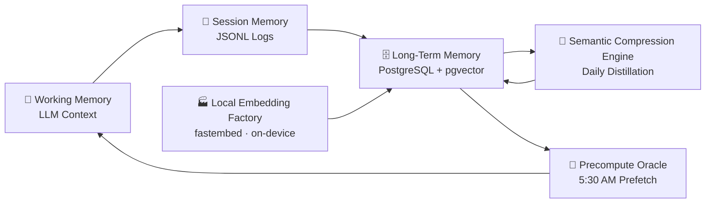
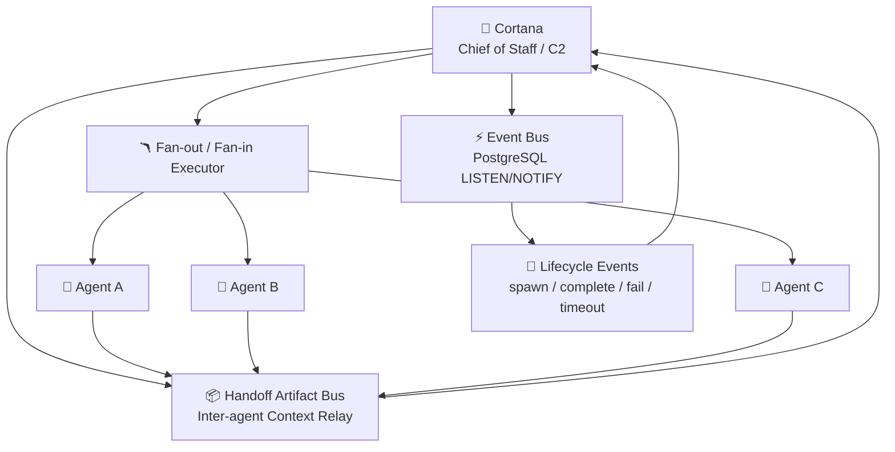
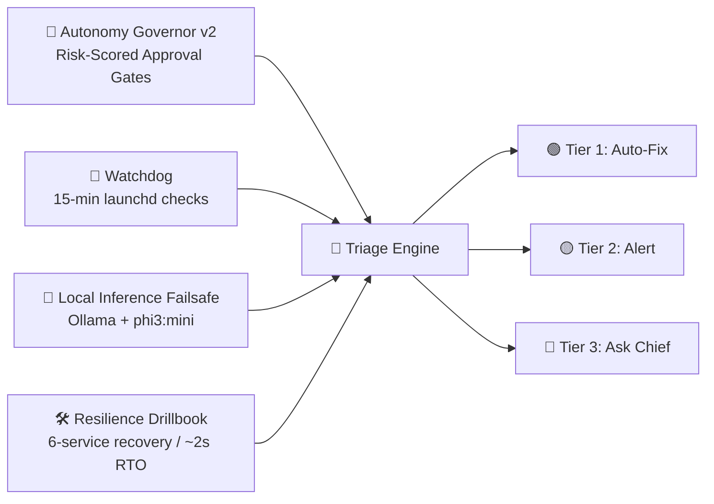
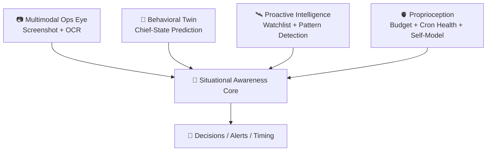
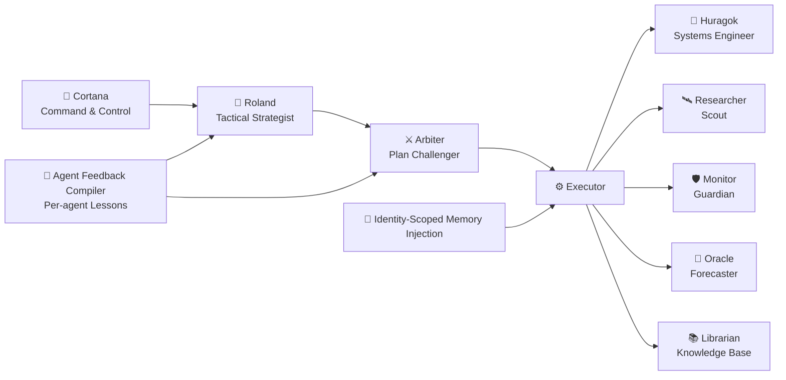

# Cortana Workspace (`~/clawd`)

Operational home for Cortana (main orchestrator session + memory + policies + cron prompts + local automation tooling).

This repo is the **brain + playbook** side of the system. Runtime services (Go APIs, mission-control UI, watchdog) live in `~/Developer/cortana-external`.

## 🧬 TLDR — Cortana's Architecture

**At a glance:** 50+ PostgreSQL tables • 5 specialized agents • 15+ autonomous tools • 10+ scheduled services (launchd + cron) • Local inference fallback • Zero-API embedding at ~1,400 texts/sec.

### 🧠 The Brain (Memory & Cognition)
Cortana thinks in layers: immediate context for now, session logs for continuity, and vector-backed long-term memory for recall. The memory loop is compressed daily, embedded locally, and prewarmed before the day starts.



### 💪 The Nervous System (Communication & Coordination)
Cortana sits at command-and-control center, routing signals between agents and systems. Events flow through a durable bus, while parallel workflows fan out and converge with structured handoffs.



### 🛡️ The Immune System (Self-Healing & Safety)
When things drift, Cortana doesn't panic—she triages. Risk gates, watchdogs, local fallback inference, and recovery playbooks enforce a tiered response: auto-fix first, then alert, then escalate for approval.



### 👁️ The Senses (Awareness & Perception)
Cortana continuously senses both machine state and human context. Vision, pattern models, proactive watchlists, and internal self-health telemetry combine into situational awareness.



### ⚔️ The Covenant (Agent Team)
Five specialized agents execute as a coordinated strike team. Cortana orchestrates a Roland → Arbiter → Executor loop, injects role-scoped memory, and continuously compiles lessons back into future runs.



---

## 1) What this repo is

This workspace contains:
- identity + behavior policy (`SOUL.md`, `AGENTS.md`, `USER.md`, `IDENTITY.md`)
- long/short memory (`MEMORY.md`, `memory/`)
- cron-driven prompt/instruction system for daily operations
- local automation scripts (`tools/`) for task board, reflection, policy, tracing, proactive detection, etc.
- architecture docs for SAE, cortical loop, proprioception, immune system
- installed local skills under `skills/`

If you’re onboarding fresh: start with **`AGENTS.md` → `SOUL.md` → `USER.md` → this README**.

---

## 2) Current top-level layout

```text
~/clawd
├── README.md
├── AGENTS.md                  # Operating rules (dispatcher model, safety, memory routines)
├── SOUL.md                    # Persona/tone contract
├── USER.md                    # Human profile and preferences
├── IDENTITY.md                # Short-form identity card
├── TOOLS.md                   # Local environment + DB table reference
├── MEMORY.md                  # Curated long-term memory
├── HEARTBEAT.md               # Heartbeat checklist/protocol
│
├── skills/                    # Installed local skills (see section 5)
├── tools/                     # Scripts/automation (task board, policy, reflection, guardrails, memory)
├── cortical-loop/             # Event watchers/evaluator state + logs
├── sae/                       # Situational Awareness Engine prompts/templates
├── immune-system/             # Threat detection docs + schema/playbooks
├── proprioception/            # Self-health/budget monitoring docs + scripts
├── memory-consolidation/      # Sleep-cycle memory pipeline docs
│
├── agents/                    # Agent notes/operational assets
├── canvas/                    # Canvas UI assets/workflows
├── covenant/                  # Subagent identities and orchestration notes
├── knowledge/                 # Research/pattern/prediction outputs
├── learning/                  # Learning artifacts/experiments
├── memory/                    # Daily logs + archives
├── migrations/                # SQL migrations for Cortana DB features
├── docs/                      # Runbooks and architecture docs
└── projects/, reports/, tmp/  # Working artifacts
```

---

## 3) System architecture (how pieces fit)

### Core runtime model
1. **Scheduled intelligence (SAE):** world-state snapshots + cross-domain insights
2. **Event-driven loop (cortical-loop):** watchers emit events; evaluator decides if wake is worth it
3. **Self-monitoring (proprioception):** health/budget/throttle state
4. **Auto-healing (immune system):** detect threats, run playbooks, escalate
5. **Memory consolidation:** distill daily logs into long-term memory
6. **Task board:** queued/epic tasks with dependency-aware execution

### Data plane
- Source of truth: **PostgreSQL `cortana`**
- Main working tables include sitrep, insights, events, wake rules, feedback, tasks/epics, health logs, immune incidents/playbooks

---

## 4) Key files you should know

- `AGENTS.md` — operational constitution (includes strict dispatcher rule: main session coordinates, subagents execute)
- `SOUL.md` — voice/personality style contract
- `TOOLS.md` — practical local config and DB table catalog
- `HEARTBEAT.md` — what periodic heartbeat runs should check
- `MEMORY.md` + `memory/YYYY-MM-DD.md` — long vs daily memory
- `sae/*.md` — world-state/reasoning/brief prompt templates
- `proprioception/README.md` + `schema.sql`
- `immune-system/README.md` + `schema.sql` + `seed-playbooks.sql`
- `tools/task-board/` — task board automation + safe auto-executor
- `tools/reflection/reflect.py` — reflection & rule extraction loop
- `tools/policy/engine.py` + `tools/policy/policies.yaml` — policy/risk guardrails

### Tooling updates (2026-02-25)
- `tools/guardrails/tone_drift_sentinel.py` — tone quality scoring aligned to `SOUL.md` behavior targets.
- `tools/task-board/auto_sync_enforcer.py` — auto-sync task board state when sub-agents complete.
- `tools/task-board/state-audit.sql` — PostgreSQL triggers for task lifecycle invariants.
- `tools/task-board/state_integrity.py` — heartbeat audit for task state drift and mismatch detection.
- `tools/reflection/recurrence_radar.py` — semantic clustering of recurring corrections.
- `tools/memory/memory_quality_gate.py` — memory entry quality scoring gate.
- `tools/proactive/evaluate_accuracy.py` — proactive signal precision/accuracy tracking.
- `tools/proactive/risk_radar.py` — cross-signal risk detection (sleep × calendar × market).
- `tools/trading/trade_guardrails.py` — pre-trade guardrail engine.
- `tools/briefing/decision_queue.py` — Morning Brief 3.0 decision queue orchestration.
- `tools/chaos/resilience_harness.py` — controlled failure injection and MTTR measurement.
- `tools/health/adaptive_sleep.py` — adaptive sleep protocol orchestrator.
- `tools/mortgage/mortgage_intel.py` — mortgage rate + policy intelligence monitor.
- `tools/career/opportunity_engine.py` — career compounding opportunity proposal engine.
- `tools/self-upgrade/capability_marketplace.py` — capability gap detection + skill proposal generation.
- `tools/email/inbox_to_execution.py` — email commitment extraction and execution pipeline.
- `tools/immune_scan.sh` — expanded with flap detection, quarantine hooks, and path verification.

### Wave 2 autonomy systems (2026-02-25)
- **Cortex Vector Spine** — `pgvector 0.8.1` installed with HNSW indexes on `cortana_memory_semantic` + `cortana_memory_episodic` for fast similarity search. Doc: `docs/vector-spine.md`
- **Local Embedding Factory** — `fastembed` (ONNX) local embeddings at **1,381 texts/sec** with zero API cost, exposed via CLI + HTTP service. Doc: `docs/local-embeddings.md`
- **Nervous System Bus** — PostgreSQL `LISTEN/NOTIFY` event backbone with durable event log; publisher/listener + PoC triggers on `task_created`, email, calendar, portfolio, and health events. Doc: `docs/event-bus.md`
- **Autonomy Governor v2** — risk-scored approval gates (`0.0–1.0`), fail-closed behavior for unknowns, integrated into task executor flow. Doc: `docs/autonomy-governor.md`
- **Semantic Compression Engine** — daily `2:00 AM` memory distillation with fidelity checks, scheduled via launchd. Doc: `docs/memory-compression.md`
- **Local Inference Failsafe** — Ollama + `phi3:mini` fallback path for API outages with automatic failover and event logging. Doc: `docs/local-inference-failsafe.md`
- **Resilience Drillbook** — six-service recovery runbook (`inventory` / `recover` / `drill`) targeting 15-minute SLO; latest drill achieved ~2s RTO. Doc: `docs/resilience-drillbook.md`
- **Precompute Oracle** — daily `5:30 AM` prefetch (weather, calendar, portfolio, recovery, email) with TTL cache support for morning brief generation. Doc: `docs/precompute-oracle.md`
- **Multimodal Ops Eye** — screenshot capture + Tesseract OCR + UI state detection for operational monitoring. Doc: `docs/multimodal-ops-eye.md`
- **Behavioral Twin** — predictive Chief-state model for timing, tone calibration, and alert gating. Doc: `docs/behavioral-twin.md`
- **Proprioception model/prompt upgrade** — proprioception crons now run on `gpt-5.3-codex` with slimmed prompts for lower token load and tighter signal.

### Sprint completion updates (Tasks 131–140, excluding 134) — 2026-02-25
- **Task 131 · Atomic Fact Extraction Pipeline** — Added structured extraction from conversations into normalized, deduplicated atomic facts to improve downstream recall and reasoning precision. Doc: `docs/atomic-fact-extraction.md`
- **Task 132 · Memory Decay + Supersession Chains** — Introduced recency/validity decay logic plus supersession graphing so stale knowledge is demoted and replaced facts are traceable. Doc: `docs/memory-decay-supersession.md`
- **Task 133 · Correlation ID Propagation + Boundary Timing** — End-to-end correlation IDs and boundary timing instrumentation now track request lineage and latency across Cortana, Roland, Arbiter, and executor boundaries. Doc: `docs/correlation-tracing.md`
- **Task 135 · Token Economics Ledger + Prompt Cache Analytics** — Added token/cost accounting with prompt cache hit-rate visibility for budget governance and prompt efficiency tuning. Doc: `docs/token-economics.md`
- **Task 136 · Agent Output Quality Scorecards** — Added measurable quality scoring per agent run for regression detection, trend monitoring, and targeted coaching. Doc: `docs/agent-quality-scorecards.md`
- **Task 137 · Conversation Insight Promotion Pipeline** — Added promotion flow to elevate high-value conversation insights into durable memory/knowledge artifacts. Doc: `docs/conversation-insight-promotion.md`
- **Task 138 · Feedback Closure Verifier** — Added closure checks ensuring applied feedback is validated end-to-end instead of only logged. Doc: `docs/feedback-closure-verifier.md`
- **Task 139 · Proactive Signal Precision Calibrator** — Added calibration loop for proactive alerts to increase precision and suppress noisy triggers. Doc: `docs/proactive-signal-calibration.md`
- **Task 140 · Durable Workflow Checkpointing Prototype** — Added checkpoint/recovery prototype for long-running workflows to improve resilience under interruption/failure. Doc: `docs/workflow-checkpointing.md`
- **Task 134 status** — explicitly deprioritized for this sprint and intentionally not included in shipped scope.

### Covenant communication infrastructure (2026-02-25)
- **Covenant Agent Routing** — intent-based routing now uses a Roland → Arbiter → Executor pipeline across the 5-agent roster: **Huragok, Researcher, Monitor, Oracle, Librarian**. Researcher identity is now first-class, intent→agent signal mapping was corrected, and handoff chain patterns are explicit (`Researcher→Librarian`, `Researcher→Oracle→Huragok`, `Monitor→Huragok`).
- **Handoff Artifact Bus (HAB)** — Cortana-controlled persistent artifact store for passing structured context between chained spawns; PostgreSQL-backed and integrated with the event bus for durable cross-agent context flow. Doc: `docs/handoff-artifact-bus.md`
- **Agent Feedback Compiler (AFC)** — compiles `cortana_feedback` into per-agent lesson blocks and auto-injects role-specific corrections at spawn time. Doc: `docs/agent-feedback-compiler.md`
- **Event Lifecycle Integration** — sub-agent lifecycle events (`spawn`, `complete`, `fail`, `timeout`) now publish to the PostgreSQL event bus, enabling real-time monitoring and health analytics for the Covenant runtime. Doc: `docs/agent-lifecycle-events.md`
- **Identity-Scoped Memory Injection** — role-filtered, recency-weighted memory injection from `cortana_memory_semantic` + `cortana_memory_episodic` into spawn prompts so each agent receives domain-relevant context only. Doc: `docs/identity-scoped-memory.md`
- **Parallel Fan-Out/Fan-In Executor** — concurrent multi-agent execution with barrier synchronization and HAB-backed result aggregation for coordinated parallel workflows. Doc: `docs/parallel-executor.md`
- **Gap-analysis driver** — the Researcher-led communication gap report that motivated AFC + lifecycle + memory + parallel proposals is documented in `docs/inter-agent-communication-gaps.md`.

---

## 5) Installed local skills (from `skills/`)

Current repo-local skills:
- `auto-updater`
- `bird`
- `caldav-calendar`
- `clawddocs`
- `clawdhub`
- `fitness-coach`
- `gog`
- `markets`
- `news-summary`
- `process-watch`
- `telegram-usage`
- `weather`

> Note: additional global skills may exist in the OpenClaw npm skill path; this list is specifically what’s present in this repo.

---

## 6) Active cron landscape (OpenClaw)

### Cron config source of truth (version-controlled)
Cron job definitions are tracked in **`config/cron/jobs.json`** in this repo.

- `config/cron/jobs.json` is the single source of truth.
- Runtime path `~/.openclaw/cron/jobs.json` is a symlink to `/Users/hd/clawd/config/cron/jobs.json`.
- Edit the repo file, commit, and push — changes are already live at runtime (no sync step).

Snapshot from `openclaw cron list` on **2026-02-25 09:xx ET**.

### Daily/weekday briefs and core ops
- Morning brief (`07:30`)
- Stock market brief (`07:45`, weekdays)
- Fitness morning brief (`08:03`)
- Fitness evening recap (`20:30`)
- Daily system health summary (`21:12`)
- Bedtime check (`22:18`)
- Newsletter alert (`*/30` between `06:00-16:59`)
- Calendar reminders (`:07` hourly `06:00-23:00`)
- CANSLIM scan (`09:30`, `12:30`, `15:30` weekdays)

### Continuous health / maintenance
- Proprioception checks (`every 15m`) + budget/self-model (`every 30m`)
- Immune scan (`:11` hourly)
- Tonal health (`every 4h`)
- Twitter auth + Amazon session keepalive (`every 8h`)
- X/fitness service healthchecks (`04:00`, `16:00`)
- Session cleanup (`02:00` daily)
- Memory consolidation (`03:12` daily)
- Auto-update (`04:22` daily)
- Weekly status/memory/fitness/market jobs (Sunday windows)

### Current notable statuses (from same snapshot)
- `🎯 Mission Advancement` → **error**
- `🏋️ Fitness Morning Brief` → **error**
- most other recurring jobs → `ok`

Use `openclaw cron list` for live status.

---

## 7) Database tables (current operational groups)

### Core operations
- `cortana_events`
- `cortana_patterns`
- `cortana_feedback`
- `cortana_tasks`
- `cortana_epics`
- `cortana_watchlist`
- `cortana_upgrades`

### SAE + cortical loop
- `cortana_sitrep`
- `cortana_insights`
- `cortana_event_stream`
- `cortana_chief_model`
- `cortana_wake_rules`
- `cortana_feedback_signals`

### Proprioception + budget
- `cortana_self_model`
- `cortana_budget_log`
- `cortana_cron_health`
- `cortana_tool_health`
- `cortana_throttle_log`

### Immune system
- `cortana_immune_incidents`
- `cortana_immune_playbooks`

### Memory/reflection/autonomy (newer autonomy stack)
- `cortana_memory_items`
- `cortana_memory_links`
- `cortana_memory_consolidation`
- `cortana_reflection_runs`
- `cortana_reflection_rules`
- `cortana_autonomy_scorecard`
- `cortana_decision_traces`
- `cortana_policy_audit`
- `cortana_chaos_runs`

Quick DB access:
```bash
export PATH="/opt/homebrew/opt/postgresql@17/bin:$PATH"
psql cortana
```

---

## 8) Integrations this workspace depends on

- **OpenClaw** runtime + cron scheduler
- **PostgreSQL 17** local (`cortana` DB)
- **Fitness/market service** at `http://127.0.0.1:3033` (from `cortana-external`)
- **Google tooling** via `gog` CLI
- **X/Twitter tooling** via `bird`
- **OpenClaw browser** (CDP at `127.0.0.1:18800`, profile managed by OpenClaw)
- **Watchdog launchd service** in external repo (`com.cortana.watchdog`)

---

## 9) Historical context worth keeping

Still relevant timeline points:
- migration from Clawdbot → OpenClaw completed (Feb 2026)
- security hardening pass completed (secret cleanup + git hygiene)
- CANSLIM pipeline integrated and running scheduled scans
- expanded autonomy stack added (memory/reflection/policy/decision tracing/chaos)

---

## 10) Day-1 operator checklist

1. `openclaw cron list` (confirm healthy schedule)
2. verify DB connectivity: `psql cortana -c "select now();"`
3. check `HEARTBEAT.md` + today’s `memory/YYYY-MM-DD.md`
4. scan recent errors:
   ```bash
   psql cortana -c "select timestamp,event_type,severity,message from cortana_events order by timestamp desc limit 20;"
   ```
5. if fitness data is stale, validate external service:
   ```bash
   curl -s http://127.0.0.1:3033/tonal/health
   ```

---

## 11) Maintenance policy for this README

Update this file whenever any of these change:
- top-level architecture or data flow
- installed skills list
- cron schedule/status conventions
- DB schema groups / key operational tables
- integration endpoints (ports/services)

Last refreshed: **2026-02-25**
