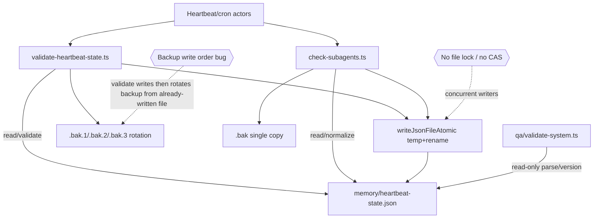
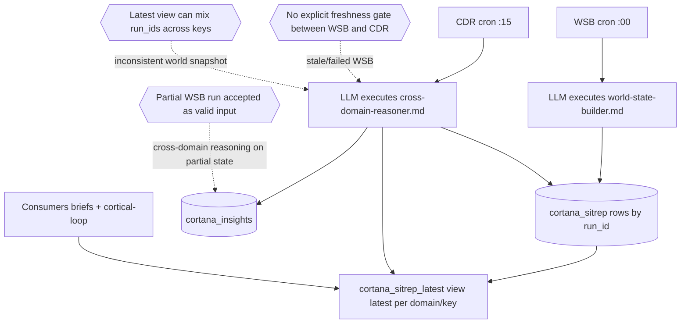

# Deep Targeted Reliability Audit — 2026-03-01

Scope audited:
1. Heartbeat state file lifecycle (`memory/heartbeat-state.json`)
2. Fitness service auth/token lifecycle (Whoop + Tonal in `~/Developer/cortana-external`)
3. SAE pipeline (World State Builder → Cross-Domain Reasoner)

Method: line-by-line code reading of relevant scripts/services + DB/cron state inspection. No files modified.

---

## 1) Subsystem: Heartbeat State File

### What I traced (all reads/writes in `~/openclaw/tools/`)

Directly references `heartbeat-state.json`:

1. `tools/heartbeat/validate-heartbeat-state.ts`
   - Reads primary state file
   - Validates schema/timestamps
   - Restores from `.bak.1/.bak.2/.bak.3` or reinitializes defaults
   - Writes state via atomic temp-file rename (`writeJsonFileAtomic`)
   - Rotates backups

2. `tools/subagent-watchdog/check-subagents.ts`
   - Reads state
   - Normalizes only `subagentWatchdog` shape
   - Writes state back (and makes `.bak` copy) via `writeJsonFileAtomic`

3. `tools/qa/validate-system.ts`
   - Reads/parses file for QA check
   - Validates only existence + JSON parse + `version>=2`
   - Read-only (no write)

4. `tools/lib/json-file.ts`
   - Shared helper used by above tools
   - Atomic write implementation: temp file + `fsync` + `rename`
   - **No lock primitive**

Also relevant: docs/instructions still reference old `.sh` wrappers in places, but actual active implementations are TS files.

### Architecture + failure points



### Key findings

1. **No locking for concurrent writers**
   - Atomic rename prevents torn writes, but does **not** serialize writers.
   - Two cron sessions writing close together can race (last writer wins).
   - Risk: one writer’s updates are silently dropped (especially `subagentWatchdog.lastLogged` map churn).

2. **Backup strategy in validator is logically flawed**
   - In `validate-heartbeat-state.ts`, sequence is:
     1) `writeJsonFileAtomic(stateFile, normalized)`
     2) `rotateBackups(stateFile)`
   - This means backups are rotated **after** overwrite and therefore back up the new file, not prior state.
   - Effect: backup chain can collapse to near-identical snapshots; poor rollback value under corruption/race incidents.

3. **Corruption handling exists only in validator path**
   - Validator robustly handles invalid/missing/stale schema and restores from backup/default.
   - `check-subagents.ts` does **not** perform full validation and can overwrite with normalized base structure if parse fails/fallback used.

4. **Blind trust / partial trust scripts**
   - `check-subagents.ts` trusts broad object shape and preserves arbitrary `lastChecks` object if present.
   - `qa/validate-system.ts` checks only parse + `version>=2`; does not verify required check keys/timestamps.

5. **Potential race between validator and watchdog backup conventions**
   - Validator uses `.bak.1/.bak.2/.bak.3`; watchdog uses single `.bak`.
   - Mixed backup policy complicates deterministic recovery and can mask chronology.

### Failure mode catalog

| Failure mode | Mechanism | Likelihood | Blast radius |
|---|---|---:|---:|
| Lost update under concurrent writes | No lock/CAS; last rename wins | High | Medium (heartbeat freshness/tracking drift) |
| Backup chain not useful during incidents | Rotate after overwrite in validator | High | Medium-High (recovery quality degraded) |
| State clobber from tolerant normalizer | Watchdog fallback + rewrite after malformed state | Medium | Medium |
| Undetected semantic corruption | QA check validates only version/parse | Medium | Medium |
| Cross-tool backup confusion | `.bak` vs `.bak.{1..3}` split | Medium | Low-Medium |

### Concrete fixes

**Quick (hours):**
1. In validator, rotate/copy backup **before** writing new state.
2. Make watchdog read path strict-validate with same validator schema (shared function).
3. Expand QA check to validate required keys + timestamp sanity.

**Medium (1-2 days):**
4. Add lock file around read-modify-write (`flock` or `O_EXCL` lockfile with timeout).
5. Unify backup policy (single ring policy used by all writers).
6. Add write telemetry (`source`, `old_hash`, `new_hash`) to `cortana_events` for race forensics.

**Heavy (3-5 days):**
7. Replace JSON file as mutable coordination state with DB row + transactional updates.
8. Optionally keep JSON as cache/export only, not source of truth.

---

## 2) Subsystem: Fitness Service Token Lifecycle (Whoop + Tonal)

Code audited:
- `~/Developer/cortana-external/main.go`
- `whoop/token_store.go`, `whoop/handler.go`, `whoop/api.go`
- `tonal/store.go`, `tonal/handler.go`, `tonal/api.go`

### Architecture + failure points

```mermaid
flowchart TD
  A[HTTP request /whoop/*] --> B[getWhoopData]
  B --> C[Load whoop_tokens.json]
  C --> D[ensureValidToken]
  D --> E[refreshTokenWithRetry 3 attempts]
  E --> F[(Whoop OAuth API)]
  D --> G[SaveTokens]
  B --> H[fetchWhoopData with API retry/backoff]
  H --> I[(Whoop data API)]
  B --> J[stale cache fallback whoop_data.json]

  K[HTTP request /tonal/*] --> L[getValidToken]
  L --> M[Load tonal_tokens.json]
  L --> N[refreshAuthentication OR password authenticate]
  N --> O[(Auth0/Tonal auth)]
  K --> P[apiCallWithSelfHeal on 401/403]
  P --> Q[forceReAuthenticate + one retry]
  K --> R[(Tonal API calls)]

  S[/health aggregator] --> T[serviceHealthWhoop + serviceHealthTonal]
```

### Key findings — Whoop

1. **Refresh retry exists, but not status-aware**
   - `refreshTokenWithRetry` retries 3 times (0s/2s/5s) on any refresh error.
   - Does not short-circuit non-retriable auth errors (e.g., invalid_grant due to expired refresh token).

2. **Expired/invalid refresh token path**
   - Refresh fails → request returns `502 token refresh failed`.
   - If stale data file exists, it serves stale cache with warning header.
   - No escalation/alert path for permanent auth break (only logs).

3. **Concurrency gap around refresh**
   - No mutex/singleflight around Whoop token refresh.
   - Concurrent requests near expiry can trigger parallel refresh attempts and token-file races.

4. **Token persistence failure is treated as success**
   - In `ensureValidToken`, if refreshed token cannot be saved, function logs warning and returns `nil`.
   - Current request succeeds, but next request may re-enter refresh loop due stale disk token.

5. **In-flight request behavior**
   - Each request independently handles refresh; no request queueing behind a shared refresh operation.
   - Can amplify load and race on degraded upstream.

### Key findings — Tonal

1. **No generic retry/backoff for Tonal API outages (5xx/network spikes)**
   - Retries are focused on auth self-heal for 401/403 only.
   - Non-auth failures bubble up quickly as 502 in data handler.

2. **Refresh token expiry behavior**
   - `getValidToken` attempts refresh token, then falls back to password auth.
   - If credentials absent/invalid and refresh token dead → hard auth failure.
   - Self-heal path can delete token file and retry auth once.

3. **Data handler has coarse mutex**
   - `tonal.Service.mu` serializes full `/tonal/data` critical section, reducing cache race issues.
   - But health checks and other code paths still call token functions independently.

4. **No explicit permanent-auth-broken alerting**
   - Failures logged to service log; no durable alert event/notification path from service itself.

### Healthcheck quality assessment

- `/whoop/health` and `/tonal/health` endpoints do real auth checks, not only process liveness.
- Aggregated `/health` in `main.go` calls:
  - `serviceHealthWhoop`: forces refresh validation (`ProactiveRefreshIfExpiring(ctx, 0)`). Good token freshness signal.
  - `serviceHealthTonal`: calls `Warmup` (`getValidToken`). Good auth validity signal.
- Limitation: health validates token/auth path, but not full downstream data-path quality (e.g., endpoint-specific 5xx, partial API outages).

### Failure mode catalog

| Failure mode | Mechanism | Likelihood | Blast radius |
|---|---|---:|---:|
| Whoop refresh storm | Concurrent requests refresh same token | Medium | Medium |
| Whoop permanent auth break silent | Invalid refresh token + no alerting | Medium | High (fitness data unavailable until manual intervention) |
| Whoop repeated refresh loop | SaveTokens failure treated non-fatal | Low-Med | Medium |
| Tonal API transient failures not retried | No 5xx/network retry policy | Medium | Medium |
| Tonal auth dead + no creds | Expired refresh + no valid env creds | Medium | High |
| In-flight request amplification on auth edge | No singleflight around token refresh | Medium | Medium |

### Concrete fixes

**Quick (hours):**
1. Add non-retriable classification for refresh errors (`invalid_grant`, `invalid_client`) and fail fast.
2. Emit structured auth-failure event to DB/event bus on repeated refresh failures.
3. If `SaveTokens` fails after refresh, return explicit error (don’t silently succeed).

**Medium (1-3 days):**
4. Add `singleflight`/mutex token refresh gate per provider (one refresh in progress, others await result).
5. Add retry/backoff + jitter for Tonal non-auth 5xx/network failures.
6. Add circuit-breaker style cooldown for repeated auth failures to avoid thrashing.

**Heavy (3-7 days):**
7. Move token storage to encrypted, lock-safe store (DB/keychain) with version/lease semantics.
8. Add active alerting integration (Telegram/Pager-like path) after N consecutive auth failures over M minutes.
9. Add synthetic end-to-end health probe that verifies one minimal data fetch per provider (not just token validity).

---

## 3) Subsystem: SAE Pipeline (World State Builder → Cross-Domain Reasoner)

Sources audited:
- Cron: `~/.openclaw/cron/jobs.json`
- Docs/instructions: `sae/world-state-builder.md`, `sae/cross-domain-reasoner.md`, `sae/README.md`
- Utility: `tools/sae/cross-domain-snapshot.ts`
- DB: `cortana_sitrep`, `cortana_sitrep_latest`, `cortana_insights`
- Related consumer: `cortical-loop/evaluator.ts`

### Confirmed runtime state

- Cron jobs enabled:
  - `🌐 SAE World State Builder`: `0 7,13,21 * * *`
  - `🧠 SAE Cross-Domain Reasoner`: `15 7,13,21 * * *` (ET)
- `cortana_sitrep_latest` view definition:
  - `DISTINCT ON (domain,key) ... ORDER BY domain,key,timestamp DESC`
- Recent runs show variable row counts per run (15–20), implying partial/inconsistent domain coverage between runs.
- High volume of error rows exists (`error`/`error_*` keys).

### Architecture + failure points



### Direct answers to required questions

1. **What does World State Builder write?**
   - Writes rows into `cortana_sitrep` with columns `(run_id, domain, key, value jsonb)`.
   - Format is key-value JSONB facts per domain; errors also written as rows (`key='error'` or similar).

2. **What does Cross-Domain Reasoner read? Does it validate freshness?**
   - Reads:
     - `cortana_sitrep_latest` (current by domain/key)
     - current run_id via latest timestamp row
     - previous run_id + rows for diffing
   - **No hard freshness gate** in prompt or schema.

3. **If WSB fails but CDR runs 15 min later?**
   - CDR still executes and reasons over whatever is in latest view/table.
   - It does not require a complete successful WSB run for that cycle.

4. **Staleness/validation gate between them?**
   - **No enforced gate.** Only convention-level sequencing by cron offset.

5. **If `cortana_sitrep` has corrupt/incomplete data?**
   - JSONB type prevents invalid JSON syntax at DB level.
   - But semantically incomplete/errored rows are common and are consumed unless model ignores them.
   - No transaction-level "run completeness" marker exists.

6. **Orphaned artifacts from before disabled state?**
   - Legacy/stale prompt artifacts exist under `cortical-loop/state/current-wake-prompt.txt` containing old sitrep snapshots and stale errors.
   - In database, mixed run cardinalities and historical error-heavy runs indicate leftover partial artifacts are retained without lifecycle constraints.

### Critical design risks discovered

1. **`cortana_sitrep_latest` is key-wise latest, not run-consistent snapshot**
   - If one run partially updates keys, latest view can blend keys from multiple runs.
   - CDR assumes coherent "current world" but may consume hybrid state.

2. **No run completeness contract**
   - No `run_status`/`expected_key_count`/`completed_at` barrier table.
   - CDR cannot reliably distinguish complete run vs partial run vs stale prior data.

3. **Prompt-level pipeline orchestration only**
   - WSB/CDR logic depends on LLM faithfully executing textual instructions.
   - No deterministic executable ETL enforcement layer.

### Failure mode catalog

| Failure mode | Mechanism | Likelihood | Blast radius |
|---|---|---:|---:|
| CDR reasons on stale state | WSB misses run; CDR has no gate | Medium | High (bad strategic outputs) |
| CDR reasons on mixed-run state | `sitrep_latest` blends per-key latest timestamps | High | High |
| Partial WSB treated as complete | No run completeness metadata | High | High |
| Error rows dominate signal | Source failures inserted as regular facts | Medium | Medium-High |
| Legacy artifact contamination | stale files/prompts reused manually | Low-Med | Medium |

### Concrete fixes

**Quick (hours):**
1. Add explicit freshness guard in CDR prompt:
   - fail/suppress if newest sitrep timestamp older than threshold (e.g., 90 min).
2. Add minimum domain/key coverage check before generating insights.
3. Mark insights with data quality flag when error keys present above threshold.

**Medium (2-4 days):**
4. Introduce `cortana_sitrep_runs` table (`run_id`, `started_at`, `completed_at`, `status`, `expected_keys`, `actual_keys`, `error_count`).
5. Make CDR consume only latest `status='completed'` run.
6. Build `cortana_sitrep_latest_completed` view scoped to the latest completed run (run-consistent snapshot).

**Heavy (1-2 weeks):**
7. Replace prompt-only ETL with deterministic executable WSB/CDR workers (typed, tested).
8. Add transactional run finalization + idempotent upserts + quality gates.
9. Add retention and quarantine policies for anomalous/error-heavy runs.

---

## Executive risk ranking (highest first)

1. **SAE run-consistency gap** (`sitrep_latest` mixed-run + no completeness gate) — strategic decision quality risk.
2. **Heartbeat concurrent writer race + weak backup semantics** — operational state integrity risk.
3. **Fitness auth permanent-failure alerting gap + refresh concurrency** — service availability risk.

## Recommended immediate action plan (next 48 hours)

1. Patch heartbeat validator backup order + add lock.
2. Add CDR freshness/completeness hard gate before insight generation.
3. Add auth-failure alert escalation and refresh singleflight for Whoop/Tonal.
4. Create `cortana_sitrep_runs` metadata table and wire WSB/CDR to it.

These four changes remove the highest-probability/highest-blast-radius failures without requiring full rearchitecture.